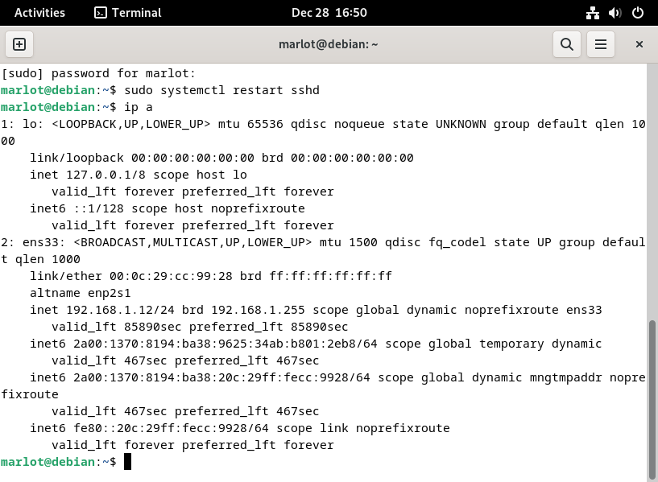
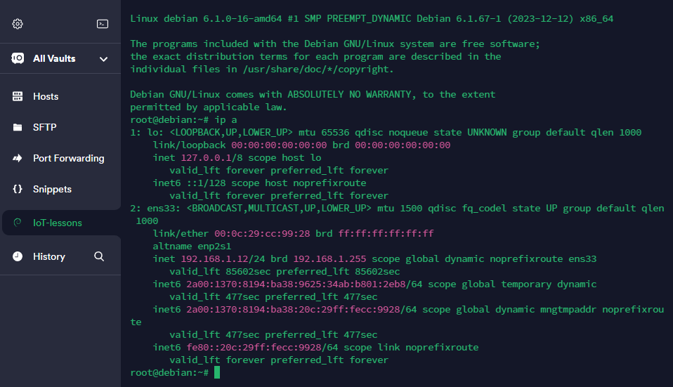
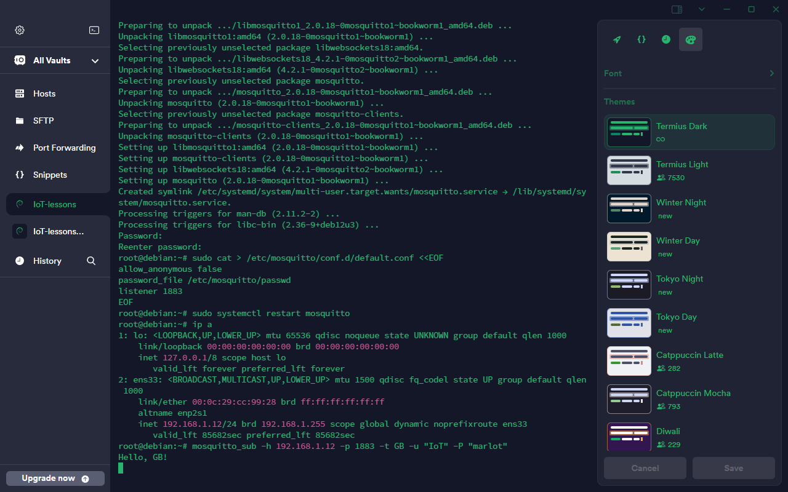
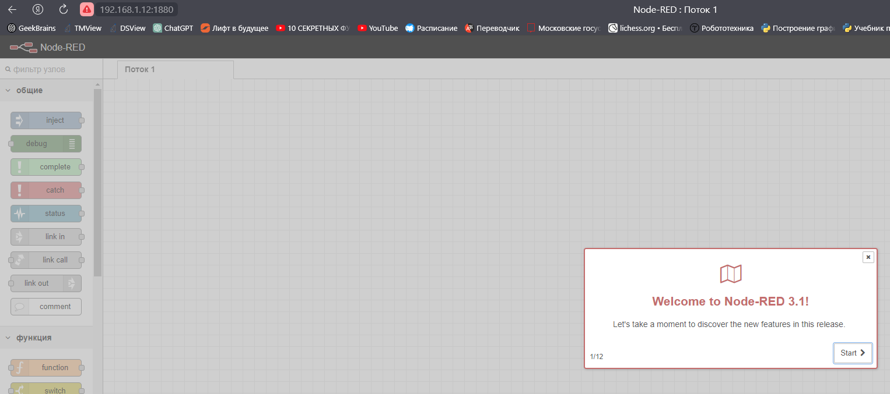
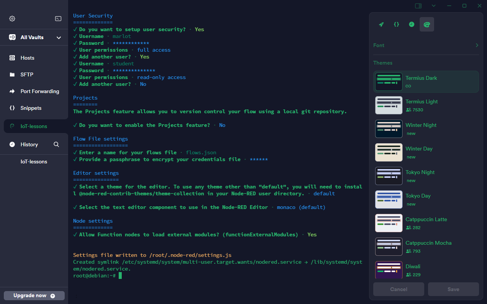
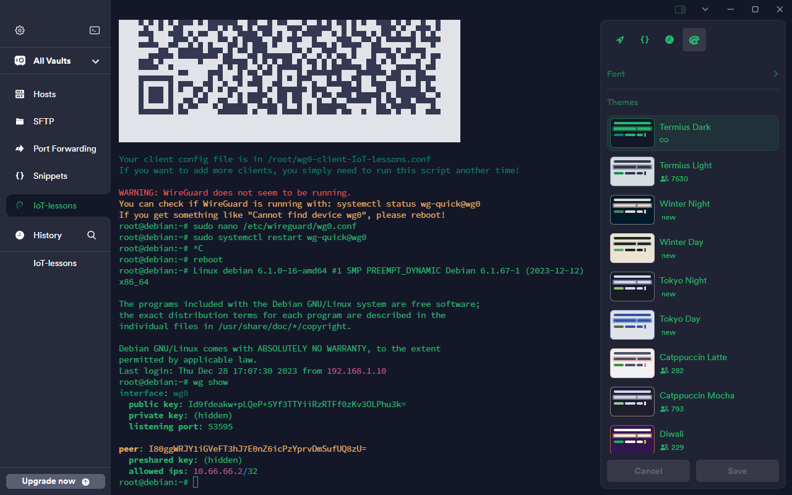
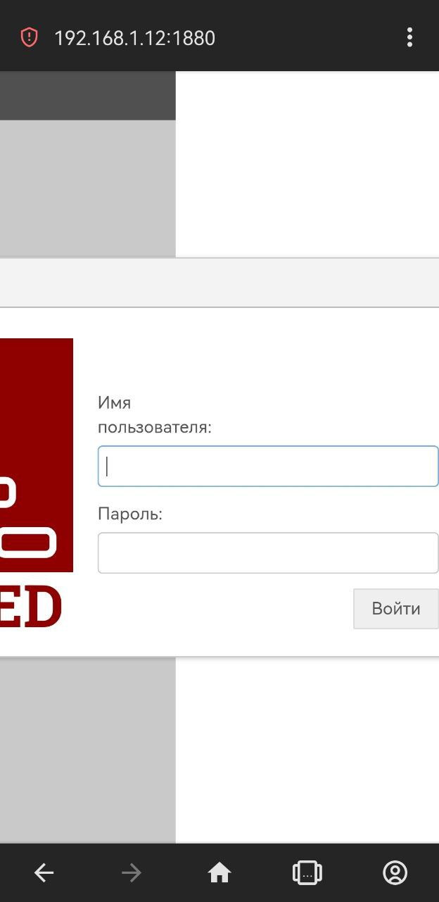
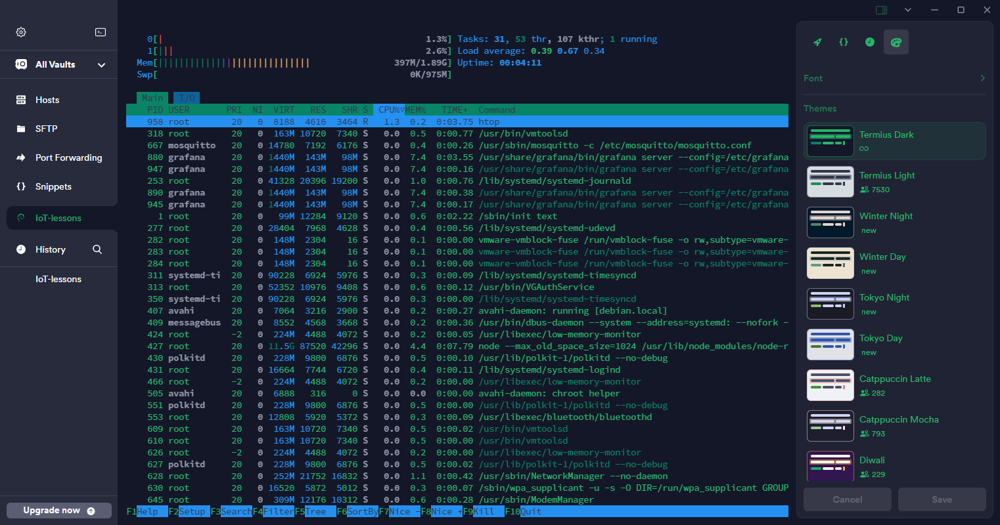
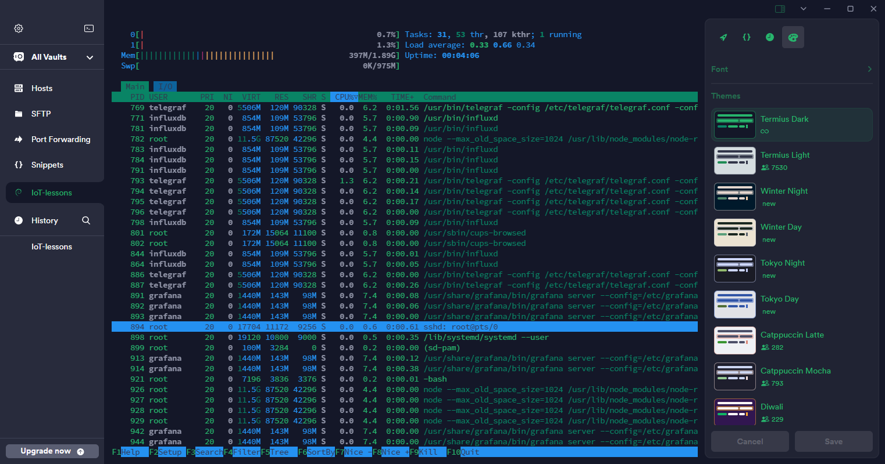

# Выполнение

## Подключение по ssh

## Подключение и проверка Mosquitto

## Установка и проверка node-red

## Установка и проверка wireguard

## Установка и проверка InfluxDB, Telegraf и Grafana

