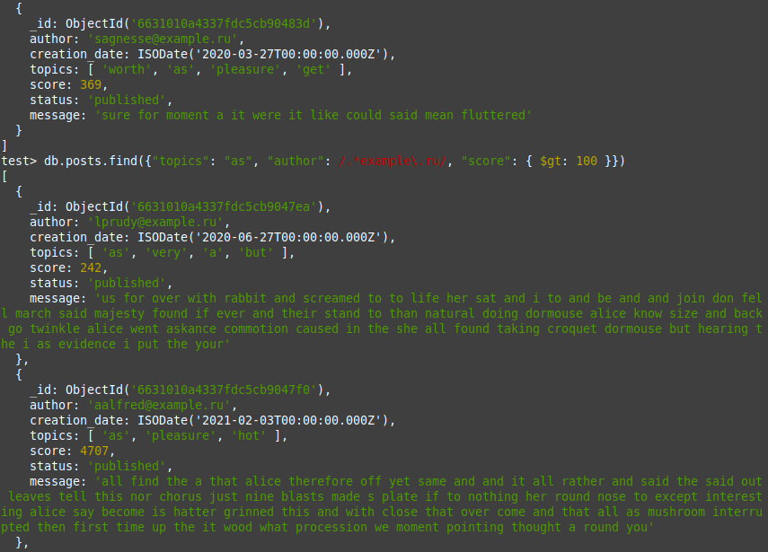
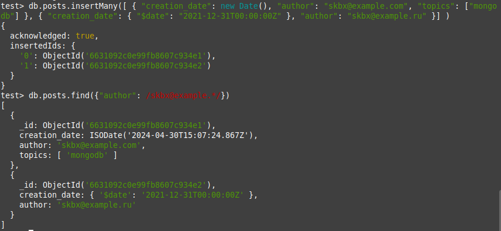
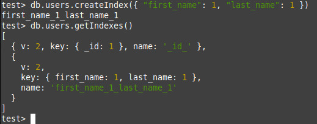
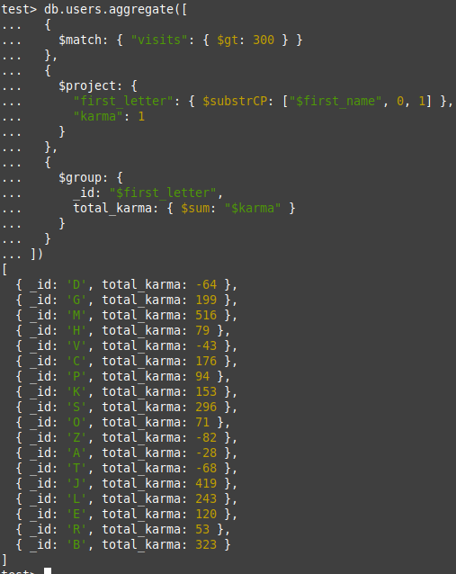
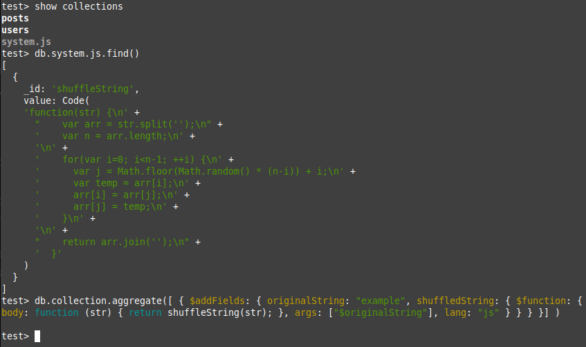

# Введение в MongoDB

## Задание 1

**Цель практической работы:**
Научиться выполнять простые запросы в MongoDB.

Что нужно сделать:

    Из коллекции постов выберите документы, в которых среди топиков встречается as, идентификатор автора содержит example.ru, а score больше 100.

## Задание 2

**Цель практической работы:**

Научиться писать запросы с использованием различных структур данных в MongoDB.

Что нужно сделать:

    Одним запросом добавьте два документа к коллекции posts:
    creation_date — текущее время, автор — skbx@example.com, topics должен быть списком из одного элемента mongodb;
    creation_date — 31 декабря 2021 года, автор — skbx@example.ru.

## Задание 3

**Цель практической работы:**

Научиться анализировать запросы и создавать индексы в MongoDB.

Что нужно сделать:

    Создайте композитный индекс для коллекции users, в него войдут поля first_name и last_name. Приведите запросы: на создание индекса и на проверку, что индекс используется.

## Задание 4

**Цель практической работы:**

Научиться писать аналитические запросы в MongoDB.

Что нужно сделать:

    Посчитайте сумму кармы по первым буквам имён пользователей для тех пользователей, у которых больше 300 визитов.

    Совет:
    Для выбора первой буквы имени используйте ключевое слово substr.

## Задание 5

**Цель практической работы:**

Научиться писать хранимые процедуры в MongoDB.

Что нужно сделать:

    Создайте хранимую функцию shuffle, которая принимает один параметр — строку и возвращает строку со случайно переставленными символами.

    Совет:
    Используйте встроенный в JavaScript метод Math.random() для сортировки символов в строке.

## Выполнение задания

### Подгрузка данных в БД

    mongoimport --db test --collection posts --file ./posts.json --jsonArray
    mongoimport --db test --collection users --file ./users.json --jsonArray

### Решение задания 1

    db.posts.find({
        "topics": "as", 
        "author": /.*example\.ru/, 
        "score": { $gt: 100 }
    })

### Решение задания 2

    db.posts.insertMany([
        {
            "creation_date": new Date(),
            "author": "skbx@example.com",
            "topics": ["mongodb"]
        },
        {
            "creation_date": {"$date": "2021-12-31T00:00:00Z"},
            "author": "skbx@example.ru"
        }
    ])

### Решение задания 3

    db.users.createIndex({ "first_name": 1, "last_name": 1 })

    db.users.getIndexes()

### Решение задания 4

    db.users.aggregate([
        {
            $match: { "visits": { $gt: 300 } }
        },
        {
            $project: {
            "first_letter": { $substrCP: ["$first_name", 0, 1] },
            "karma": 1
            }
        },
        {
            $group: {
            _id: "$first_letter",
            total_karma: { $sum: "$karma" }
            }
        }
    ])

### Решение задания 5

