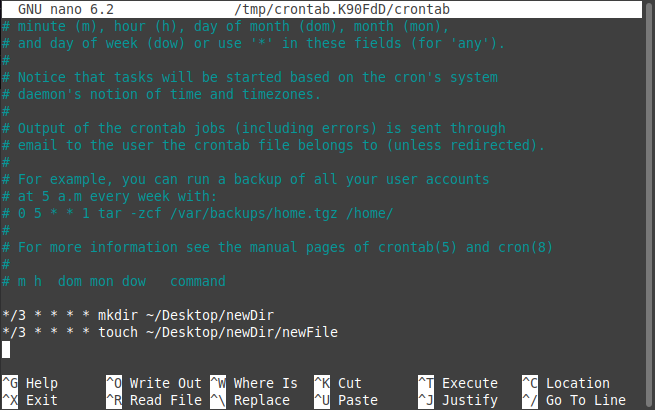
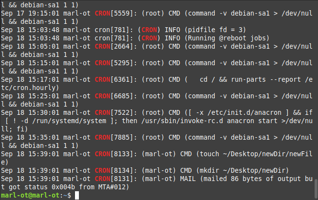

# Задание

- Подключить дополнительный репозиторий на выбор: Docker, Nginx, Oracle MySQL. Установить любой пакет из этого репозитория.
- Установить и удалить deb-пакет с помощью dpkg.
- Установить и удалить snap-пакет.
- Добавить задачу для выполнения каждые 3 минуты (создание директории, запись в файл).
- **Подключить PPA-репозиторий на выбор. Установить из него пакет. Удалить PPA из системы.**
- **Создать задачу резервного копирования (tar) домашнего каталога пользователя. Реализовать с использованием пользовательских crontab-файлов.**

# Выполнение

1. Подключить дополнительный репозиторий на выбор: Docker, Nginx, Oracle MySQL. Установить любой пакет из этого репозитория.

        *Commands for add Docker'soffical GPG key\*

        Add the repository to Apt sources:

        $ echo \
        "deb [arch="$(dpkg --print-architecture)" signed-by=/etc/apt/keyrings/docker.gpg] https://download.docker.com/linux/ubuntu \
        "$(. /etc/os-release && echo "$VERSION_CODENAME")" stable" | \
        sudo tee /etc/apt/sources.list.d/docker.list > /dev/null

        $ sudo apt-get update

        $ sudo apt-get install docker-ce docker-ce-cli containerd.io docker-buildx-plugin docker-compose-plugin

2. Установить и удалить deb-пакет с помощью dpkg.

    Download .deb package: https://desktop.docker.com/linux/main/amd64/docker-desktop-4.23.0-amd64.deb

    Install .deb package:

        $ cd ~/Downloads
        $ sudo apt-get install ./docker-desktop-4.23.0-amd64.deb

    Delete .deb package:

        sudo dpkg --remove docker-desktop

3. Установить и удалить snap-пакет.

        $ sudo snap install chromium

        $ sudo snap remove chromium

4. Добавить задачу для выполнения каждые 3 минуты (создание директории, запись в файл).

Логи Cron'a:

