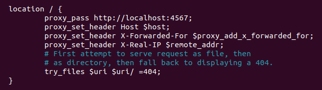
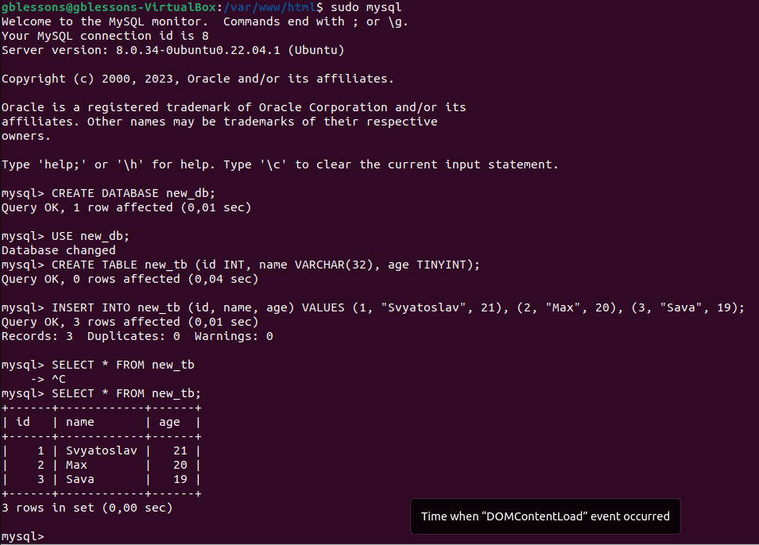

# Задание

1. Установить Nginx и настроить его на работу с PHP-FPM.
2. Установить Apache. Настроить обработку PHP. Добиться одновременной работы с Nginx.
3. Настроить схему обратного прокси для Nginx (динамика - на Apache).
4. Установить MySQL. Создать новую базу данных и таблицу в ней.
5. **Установить пакет phpmyadmin и запустить его веб-интерфейс для управления MySQL.**
6. **Настроить схему балансировки трафика между несколькими серверами Apache на стороне Nginx с помощью модуля ngx_http_upstream_module.**

# Выполнение

1. Установить Nginx и настроить его на работу с PHP-FPM.

        $ sudo apt install nginx

        $ sudo apt install php-fpm

2. Установить Apache. Настроить обработку PHP. Добиться одновременной работы с Nginx.

        $ sudo apt install apache2

        $ sudo apt install libapache2-mpd-php8.1

        *Настройка портов для взаимодействия Nginx и Apache через конфиги*

3. Настроить схему обратного прокси для Nginx (динамика - на Apache).

4. Установить MySQL. Создать новую базу данных и таблицу в ней.

