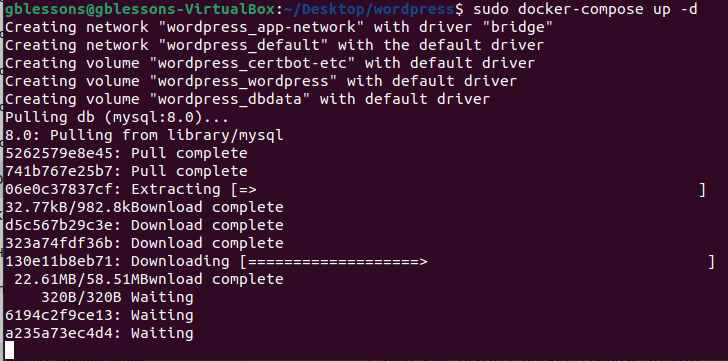
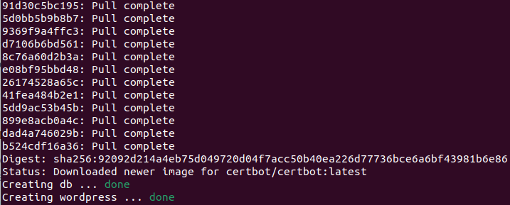

# Задание

- Установить в виртуальную машину или VDS Docker, настроить набор контейнеров через docker compose по инструкции. (Часть с настройкой certbot и HTTPS опустить, если у вас нет настоящего домена и белого IP)
- Запустить два контейнера, связанные одной сетью (используя документацию).
Первый контейнер БД (например, образ mariadb:10.8), второй контейнер — phpmyadmin.
Получить доступ к БД в первом контейнере через второй контейнер (веб-интерфейс phpmyadmin).

# Выполнение

Набор docker-composes:

