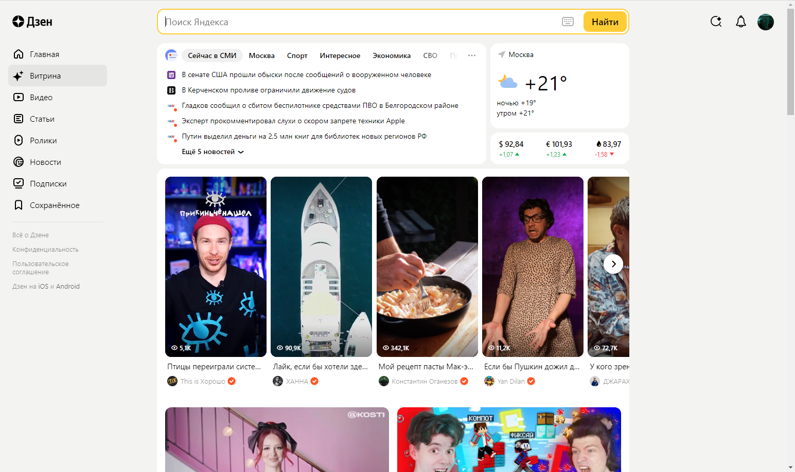
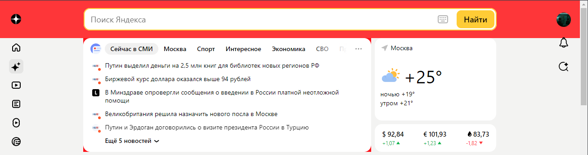
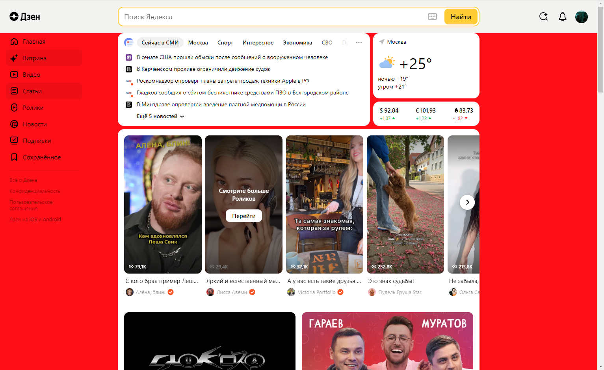
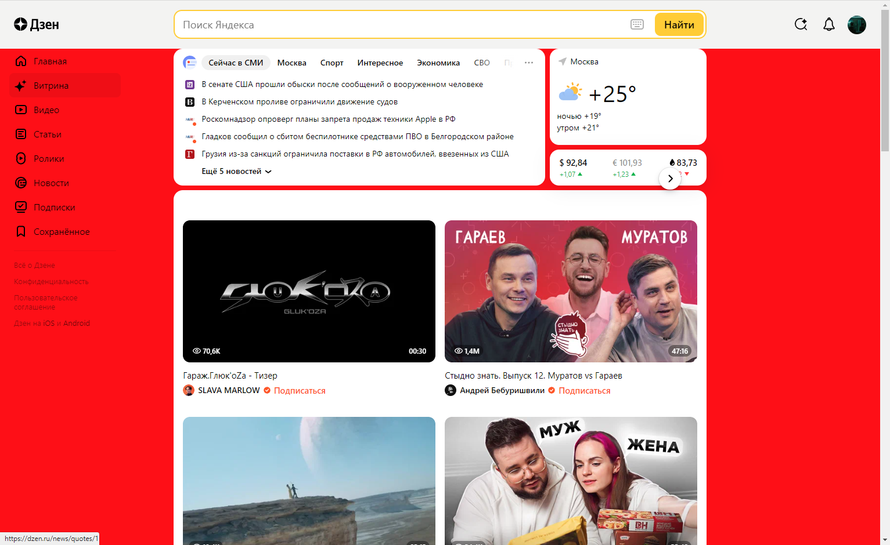
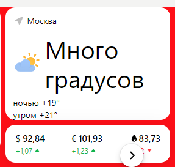
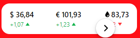
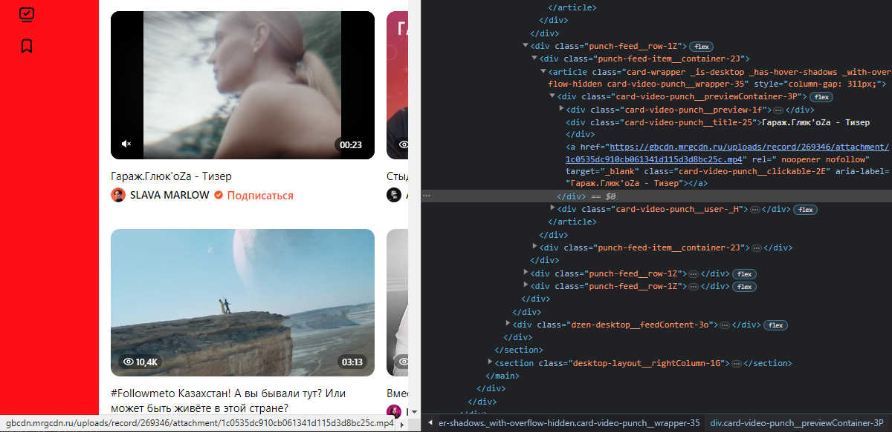
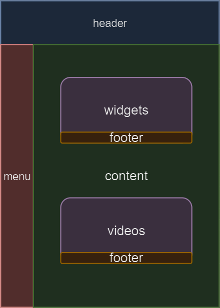

Задача: на основе сайта yandex.ru:
- Определите, на каком протоколе работает сайт.
- Проанализируйте структуру страницы сайта.
- Внесите не менее 10 изменений на страницу с помощью инструмента разработчика и представьте скриншоты было/стало.
- Создайте прототип низкой детализации.

Выполнение работы:
1. Сайт работает на протоколе HTTPS, он отличается от HTTP передачей инфомрации в зашифрованном виде;
2. Сайт состоит из header'a, content'a с виджетами и footer'a;
3. Внесены некоторые изменения в базовую страницу яндекса:

- Базовая страница яндекса:

- Изменение заднего фона блока поиска на красный цвет:

- Изменение заднего фона блока контента на красный цвет:

- Удаление виджетов из блока контента:

- Изменение градусов и курса валют:

- Изменение заданной ссылки на ссылку на семинар (Правда явно превью не отрисовывается):

4. Создайте прототип низкой детализации:

