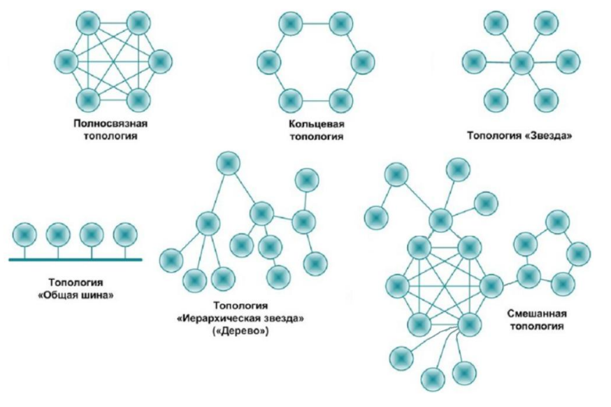

***
# Удобные комбинации клавиш в VScode
***
Автоматическое форматирование кода в Visual Studio Code выполняется следующими комбинациями:
- Windows: Shift + Alt + F
- Mac: Shift ⇧ + Option ⌥ + F
- Ubuntu: Ctrl + Shift + I
***
# **Умение учиться**
***
## __Как эффективно приобретать новые знания__
Учиться – это привилегия. Не каждый мог себе позволить учиться. Знания – это достояние. Сила знаний много раз изменяла ход мировой истории. Сейчас информации настолько много, что чтобы не отставать от прогресса необходимо учиться постоянно.

Спиральная модель обучения.
1. Теплая вода с медом к каждому уроку.
2. Конспекты каждого урока от руки
3. Облако знаний в Google Drive

## ___Инструменты обучения___
1. Конспекты каждого урока от руки
2. Облако знаний в Google Drive
3. Синопсис по темам без подсматривания в материалы
4. Практические задания без проверки для обеспечения касания новых знаний

Это обеспечение 4х касаний. «Человек гарантированно запоминает новое, если он столкнулся с ним не менее 3х раз на относительно коротком промежутке времени в разных формах».

## ___4 темы обучения___
1. Нейронаука и обучение. *Как мозг воспринимает и обрабатывает новое*
2. Учеба как проект. *Планирование, задачи и контроль прогресса*
3. Память и блоки смыслов (чанки). *Рабочая и долговременная память. Формирование блока смыслов – чанкинг. Другие инструменты запоминания.*
4. Прокрастинация и другие ловушки мышления. *Как учиться быстро не делая бесполезного*

## ___Перерывы___
Мозг наиболее активен во время отдыха. Делать перерывы необходимо, потому что мозг не перестает работать и при рассеянном внимании (когда “барьеры мозга” отключены), связей может создаваться больше и в голову могут приходить неожиданные решения.

## ___Нейронаука и обучение___
1. Знания
- Мозг – комплексный и мощный инструмент. Он работает постоянно.
- Все новое – это нейронные связи
- «Рассеянный» режим мощнее «фокусного»
3. Умения
- Делать регулярные перерывы в любой деятельности без стресса и страха «потерять» время
3. Установки
- Управлять своей жизнью можно через изменение работы мозга
- Перерыв для отдыха – это не потеря времени, а переключение режимов работы мозга
***
# __I четверть «Разработчик python»__
***
## 0. __Математика и информатика для программистов__
***
### ___Информатика___
1. Естественная (Попытка связать информационные технологии и окружающую нас деятельность)
- Компьютерная графика
- Базы данных
- Искусственный интеллект
2. Теоретическая (Математическая логика, теория конечных автоматов, теория информации, теория кодирования и др.)
- Информация и теория кодирования
- Анализ производительности
- Алгоритмы и структуры данных
3. Прикладная (Железо, ПО, информационные системы и др.)
- Теория алгоритмов
- Архитектура компьютера
- Компьютерные сети

### ___Какими свойствами обладает информация:___
1. Объективность (Характеризует ее независимость от чьего-либо мнения или сознания, а также от методов получения)
2. Точность (Определяется степенью ее близости к реальному состоянию объекта/процесса/явления)
3. Актуальность (Степень соответствия информации текущему моменту времени)
***
## __1. Введение в программирование__
***
**Блок-схемы** – это унифицированная форма записи алгоритма. Любой программист увидев схему, может создать одинаковый алгоритм на разных языках программирования. Также блок-схема непонятна компьютеру.

#### *Массив*

Важно сначала продумать алгоритм программы, чтобы понять как думает компьютер, а потом только перенести это в код (возможно под конкретную задачу придется подобрать конкретный ЯП со своими принципами).

**Массив** – структура данных, хранящая набор объектов с индексами (причем количество элементов массива, тип элементов массива известны заранее, также есть поиск по индексу).

Параметры массива (нам известны):
1. Начало массива (адрес первой ячейки с элементом массива)
2. Размер каждого элемента массива (сколько ячеек памяти занимает каждый элемент массива)
3. Количество элементов в массиве.

Правила хорошего тона:
1. Имя массива несет смысловую нагрузку и в множественном числе;
2. Использование чисел (*магических чисел*) в программе нежелательно. Лучше использовать параметры.

### ___Что такое программа?___
Это текстовый файл с расширением. Расширение нужно для удобства пользователя, с ними ему не нужно определять с помощью какой программы открыть файл.

Определения *«низкоуровневые»* (assembler) и *«высокоуровневые»* (python, java) языки программирования определяют количество посредников между компьютером и человеком. Чем меньше посредников, тем меньшего уровня язык.

Программы (посредники), которые переводят команды понятные человеку в команды понятные машине называют трансляторы. Они бывают двух типов:

1. Интерпретаторы (python)

*Каждая часть кода интерпретируется и выполняется отдельно и последовательно, и если в какой-то  части будет найдена ошибка, она остановит интерпретацию кода без трансляции следующей части кода. После этого, если в коде не найдено ошибок, то он будет транслирован в машинный код.*

2. Компиляторы (java)

*Сначала сканирует всю программу, а потом транслирует ее в машинный код*

Типы ошибок:
1. Синтаксические (неправильное написание команд или синтаксиса языка)
2. Ошибки выполнения (например, деление на 0)
3. Логические ошибки (результат программы не соответствует ожиданиям)

### ___Сортировка пузырьком1___
Последовательно сравниваются значения соседних элементов и числа меняются местами, если предыдущее оказывается больше последующего. Таким образом элементы с большими значениями оказываются в конце списка, а с меньшими остаются в начале
Это цикл в цикле, где количество итераций внешнего цикла = (количество элементов массива). А количество итераций внутреннего цикла = (количество элементов массива-индекс внешнего цикла-1).

### ___Особенности массива___
1. Все элементы имеют один тип
2. Весь массив имеет одно имя
3. Все элементы расположены в памяти рядом

Примеры:
- Список учеников в классе
- Квартиры в доме
- Школы в городе
- Данные о температуре воздуха в год
- Крючки гардероба в театре
- Подземная парковка
- Шкафчики в школе

Антипримеры:
- Лес
- Места в вагоне метро
- Стулья в школьной столовой

**Псевдокод** — это неформальное описание алгоритма (без синтаксиса языка).

### ___Оптимизированность алгоритмов___
**O(n)** - функция, которая ограничивает функцию сверху. То есть максимальное ограничение функции сверху. Также существует o(n) - это ограничение снизу.

***
## __2. Введение в контроль версий (git)__
***
### ___Инструкция по работе с системой контроля версий Git___
Git — распределённая система управления версиями. Проект был создан Линусом Торвальдсом для управления разработкой ядра Linux, первая версия выпущена 7 апреля 2005 года. На сегодняшний день его поддерживает Джунио Хамано.

### ___Инициализация репозитория___
Чтобы создать (инициализировать) новый репозиторий нужно в терминале ввести команду:

    git init

Репозиторий будет создан в той папке, из которой вызывалась команда

### ___Проверка состояния репозитория___
Чтобы проверить текущее состояние репозитория нужно ввести в терминале команду:

    git status

### ___Добавление изменения к отслеживанию версионности___
Чтобы добавить сделанное изменение к отслеживанию (поместить в индекс) нужно ввести команду:

    git add <имя файла>

где вместо <имя файла> вводится путь к файлу относительно расположения репозитория.

### ___Фиксация изменений___
Чтобы зафиксировать изменение используется команда:

    git commit

В таком случае откроется окно для ввоба краткого описания сделанных изменений.

Чтобы сделать это одновременно с фиксацией используется команда:

    git commit -m "комментарий"

### ___Просмотр истории изменений___
Чтобы посмотреть историю изменений используется комада

    git log

Для просмотра изменений с выводом одного коммита в одну строку используется команда

    git log --oneline

Для просмотра всех имеющихся коммитов используется команда

    git log --all

Для просмотра лога с графическим изображением веток используется команда

    git log --graph

Все указанные флаги могут использоваться вместе:

    git log --all --oneline --graph

### ___Просмотр различий между изменениями___
Для просмотра отличий между текущим состоянием репозитория и последним сохраненным изменением используется команда

    git diff

Можно также посмотреть разницу между любыми двуми коммитами. Для этого используется команда

    git diff <хэш1> <хэш2>

### ___Переключение на нужное изменение___
Чтобы переключиться на нужный коммит используется команда

    git checkout <хэш>

### ___Ветки в Git___
#### Создание новой ветки
Чтобы создать новую ветку используется команда

    git branch <имя_ветки>

#### ___Просмотр всех веток___
Чтобы посмотреть какие ветки существуют и на какой мы находимся используется команда

    git branch

#### ___Переключение между ветками___
Чтобы переключиться на другую ветку используется команда

    git checkout <имя_ветки>

#### ___Слияние веток___
Чтобы влить одну ветку в другую необходимо находясь в целевой ветке (КУДА будем делать слияние) выполнить команду

    git merge <имя_вливаемой_ветки>

#### ___Конфликты при слиянии___
Если одна и та же строка в разный версиях записана по разному возникнет конфликт.
Чистый гит автоматически сохраняет оба изменения, далее требуется вручную внести нужные правки и сделать коммит.

VSСode дает возможность выбрать какое изменение сохранить (входящее, существующее или оба).

#### ___Удаление ветки___
Чтобы удалить ветку, которая больше не нужно (например после слияния) используется команда

    git branch -d <имя_ветки>

#### ___Создание fork___
Это создание ветвления проекта в собственном пространстве, что позволяет вносить публичные изменения и делать свой собственный вклад в более открытом виде.

#### ___Pull request___
Это запрос на интеграцию изменений из одной ветки в другую. Они позволяют разработчикам делиться внесенными в код изменениями с другими участниками одной системы.
***
## 3. **Знакомство с языками программирования**
***
### ***Первые шаги написания программы:***
1. Получить задачу
2. Обдумать условие
3. Уточнить условие
4. Составить алгоритм
5. Уточнить алгоритм
6. Исправить алгоритм
7. Перепроверить алгоритм
8. Начать писать код

### ___Что такое программа?___
- 1 уровень – интерфейс
- 2 уровень – логика (самый важный слой)
- 3 уровень – данные

**Программа** — это набор алгоритмов, которые на вход получают какие-то данные и на выходе выдают какие-то данные.

Перед тем как приступить к программированию стоит сначала продумать алгоритм, который будет решать поставленную задачу.

### ___Уточнение функциональных требований___
Перед началом разработки стоит задать ряд уточняющих вопросов.
1. *Что нужно сделать?*

Написать программу сложения двух чисел.

2. *На каком именно языке программирования нужно реализовать задачу?*

Написать программу на языке C#, которая складывает два числа.

3. *На каких устройствах должна работать программа?*

Написать программу на языке C#, работающую на Windows и Mac OS, которая складывает два числа.

4. *Откуда берутся эти числа?*

Написать программу на языке C#, работающую на Windows и Mac OS, [в которую пользователь вводит два числа] или [в которой записаны два числа] или [два числа генерируются случайным образом] и получает их сумму.

5. *Куда нужно отобразить результат?*

Написать программу на языке C#, работающую на Windows и Mac OS, [в которую пользователь вводит два числа] или [в которой записаны два числа] или [два числа генерируются случайным образом] и выводит их сумму в терминал.

6. *С какими числами мы работаем?*

Написать программу на языке C#, работающую на Windows и Mac OS, [в которую пользователь вводит два целых числа] или [в которой записаны два целых числа] или [два целых числа генерируются случайным образом] и выводит их сумму в терминал.

### ___Синтаксис языка C#___
#### ***Базовые команды***
Вывод данных в окно терминала с переходом в конце на новую строку:

    Console.WriteLine(<данные>);

Считать строку из терминала:

    Console.ReadLine();

Определяем введенные пользователем строковые данные в переменную text:

    string text = Console.ReadLine();

Вывод данных в окно терминала в одну строку:

    Console.Write(<данные>);

Определение переменной X, в которой может храниться только целое число:

    int X = 3;

Определение переменной X, в которой может храниться как целое так и вещественное число:

    double X = 1,3;

Определение переменной X, в которой может храниться только строка:

    string X = "данные"

Определение переменной X, в которой может храниться либо истина, либо ложь (0 или 1):

    bool X = false

Определение массива со значениями от 1 до 4:

    int[] array = {1, 2, 3, 4};

Указание множества переменных одного типа:

    int x = 1, y = 2, z = 3,
        b = 3, c = 4;

Перезапись элементов массива:

    array[0] = 12;

#### ___Математические операции___

    | Знак операции | Операция                  |
    | +             | Сложение                  |
    | -             | Вычитание                 |
    | *             | Умножение                 |
    | /             | Деление (зависит от типа) |
    | %             | Остаток от деления        |
    | //            | Целочисленное деление     |
    | **            | Возведение в степень      |
    | ()            | Приоритет операций        |

#### ***Цикл while и ветвления if-else***
Ветвление if (если, то…, иначе …):

    if ()
    {
        …;
    }
    else
    {
        …;
    }

Цикл while (до тех пор пока выполняется условие, выполнять следующее действие):

    n = 5
    while (n < 10)
    {
        n = n + 1; (или n++;)
    }

#### ***Функции и массивы***
Общее описание функции:

    ВозвращаемыйТипДанных ИмяМетода([ТипДанных1 ИмяАргумента1, …])
    {
        Тело метода;
        return ЗначениеСоответствующееВозвращаемомуТипуДанных;
    }

Пример написания функции:

    double f(double x)
    {
        double result = x * x + 1;
        return result;
    }

Генерация случайного целого числа от min (включительно) до max:

    new Random().Next(min, max)

Переводит все символы текста в нижний регистр:

    text.ToLower()

Зафиксировать позицию курсора в окне терминала:

    Console.SetCursorPosition(<отступ от левого края>, <отступ от верхнего края>)

Очистить консоль:

    Console.Clear();

Запись длины массива в переменную len:

    int len = array.Length;

Создать новый массив, в котором будет 10 элементов и запиши его в переменную array (по умолчанию будет заполнен нулями):

    int[] array = new int[10];

Создание метода, который заполняет заранее созданный массив случайными числами от 1 до 10. 
void методом называют метод, который ничего не возвращает (нет оператора return):

    void FillFrray(int[] collection)
    {
        int length = collection.Length;
        int index = 0;
        while (index < length)
        {
            collection[index] = new Random().Next(1,10);
            index++;
        }
    }
***
## 4. Знакомство с базами данных
***
Понятия:

**Иерархическая модель баз данных** – модель данных, где используется представление базы данных в виде древовидной (иерархической) структуры, состоящей из объектов (данных) различных уровней.

**Первичный ключ (id)** – ключ отношения. Обладает свойствами минимальности и уникальности. Как правило выбирается такое, который содержит в себе минимальное количество атрибутов.

**Потенциальный ключ** – подмножество атрибутов отношения, отвечающих свойствами уникальности и минимальности (несократимости).

**Внешний ключ** – представляет собой подмножество атрибутов некоторого первичного ключа, значения которых должны совпадать со значениями некоторого потенциального ключа.

**Атрибут** – это свойство, которое характеризует объект (название столбца).

### ___Работа с данными из разных таблиц___
- **Вывести** – скопировать
- **Выбрать** – как правило N количество столбиков
- **SELECT \* FROM <общий список>**, где 
- **SELECT** – выбери, 
- **\*** – все столбцы, 
- **FROM** – <из> (откуда, из какой таблицы)
***
- **WHERE "атрибут" <условие>** – так обозначается, если нужно выбрать строки с данными по определенному признаку
- **ON <условие>** – так обозначается то, по какому признаку будет осуществляться INNER JOIN

### ***Пересборка таблиц между собой при исползовании реляционных таблиц***
- **INNER JOIN** – Результатом будут те данные, которые относятся как к одной таблице, так и к другой таблице (L∧R);
- **LEFT JOIN** – Результатом будут те данные, которые относятся к левой таблице и те, которые находятся в пересечении(L);
- **RIGHT JOIN** – Результатом будут те данные, которые относятся к правой таблице и те, которые находятся в пересечении(R);
- **FULL JOIN** – Результатом будут данные из каждой таблицы(L∨R).

### ***Создание структуры базы данных***
**Связи**
1. ForeignKey
2. **Один к одному** 

Когда объекту A может соответствовать только один объект B. Это самая редкая связь. Как правило, в таком случае необходимо объединить две таблицы в одну.

Таблицы будут связаны один к одному тогда, когда одному объекту таблицы А соответствует один объект таблицы Б, и одному объекту таблицы Б соответствует один объект таблицы А. Если вы видите, что связь один к одному – смело объединяйте таблицы в одну, за исключением тех случаев, когда происходит модернизация базы данных.

*Например:* 
У нас была таблица, в которой хранились данные о сотрудниках компании. Но произошли какие-то изменения в бизнес-процессе и появилась необходимость создать таблицы с теми же самыми сотрудниками, но не для всей компании, а разбив их по отделам. Таблицы отделов будут дочерними по отношению к таблице, в которой хранятся данные обо всех сотрудниках компании, и связаны такие таблицы будут связью один к одному.

3. **Один ко многим** 

Когда объекту A может принадлежать или же соответствовать несколько объектов Б, но объекту Б может соответствовать только один объект А. 

*Например:*
У нас есть таблица, в которой содержатся данные о клиентах и у нас есть таблица, в которой хранятся их телефоны. Мы можем смело утверждать, что у одного клиента может быть несколько телефонов, но в тоже время мы можем быть уверены в том, что один конкретный номер может быть только у одного клиента. Это типичный пример связи один ко многим.

4. **Многие ко многим**

Когда нескольким объектам из таблицы А может соответствовать несколько объектов из таблицы Б, и в тоже время нескольким объектам из таблицы Б соответствует несколько объектов из таблицы А. 

*Например:*
У нас есть таблица с книгами и есть таблица с авторами. Приведем два верных утверждения. Первое: одну книгу может написать несколько авторов. Второе: автор может написать несколько книг. Здесь мы наблюдаем типичную ситуацию, когда связь между таблицами многие ко многим. Такая связь (связь многие ко многим) реализуется путем добавления третьей таблицы.

### ***Нормы составления таблиц СУБД***
Стандартизированные или статичные данные следует выносить в отдельные таблицы с <константами>, чтобы избежать ошибок в написании и через id обращаться к этим <константам>.

***
## 5. Знакомство с языком программирвоания Python
***
### ***Базовые типы данных***
- int (Целые числа)
- float (Дробные/вещественные числа)
- bool (Логический тип данных true/false)
- str (Строка)

### ***Определение типы данных в переменной***

    print(type(<name>))

### ***Объявление строки***

    s = "Hello,"
    w = "world"
    print(s, w)

### ***Интерполяция строк***
Программа:

    a = 3
    b = 11
    s = 2022
    print(a, b, s)
    print(a,'-'b,'-'s)
    print('{} - {} - {}'.format(a,b,s))
    print(f'first - {a} second - {b} third - {s}')

Вывод:

    3 - 11 - 2022

### ***Оператор ввода данных***

    input(<данные>)

### ***Встроенные типы данных***

    int(<данные>) - переводит в целое число, если это возможно
    str(<данные>) - переводит в строку, если это возможно
    float(<данные>) - переводит в дробное число, если это возможно

### ***Арифметические операции***

Если в списке python тип элементов ссылка, то как это хранится в памяти компьютера?

Поскольку в python динамическая типизация, то как только определяется какой-то объект.

    | Знак операции | Операция              |
    | +             | Сложение              |
    | -             | Вычитание             |
    | *             | Умножение             |
    | /             | Деление (в float)     |
    | %             | Остаток от деления    |
    | //            | Целочисленное деление |
    | **            | Возведение в степень  |
    | ()            | Приоритет операций    |

### ***Приоритет операций***
1. Возведение в степень (\*\*)
2. Умножение (\*)
3. Деление (/)
4. Целочисленное деление (//)
5. Остаток от деления (%)
6. Сложение (+)
7. Вычитание (-)

### ***Сокращенные операции присваивания***

    iter = 2
    iter += 3 # iter = iter + 3
    iter -= 4 # iter = iter - 4
    iter *= 5 # iter = iter * 5
    iter /= 6 # iter = iter / 6
    iter %= 7 # iter = iter % 7
    iter //= 8 # iter = iter // 8
    iter **= 9 # iter = iter ** 9

### ***Логические операции***

    | Знак операции | Операция         |
    | >             | Больше           |
    | >=            | Больше или равно |
    | <             | Меньше           |
    | <=            | Меньше или равно |
    | ==            | Равно            |
    | !=            | Не равно         |
    | not           | Не (отрицание)   |
    | and           | И (конъюнкция)   |
    | or            | Или (дизъюнкция) |

### ***Сложные услвоия***

    if condition1:
        # operator
    elif condition2:
        # operator
    elif condition3:
        # operator
    else:
        # operator
***
    if condition1 and condition2: 
    # выполнится, когда оба условия окажутся верными
        # operator
    if condition3 or condition4: 
    # выполнится, когда хотя бы одно из условий окажется верным
        # operator

### ***Цикл While***

    while condition:
        # operator 1
        # operator 2
        # ...
        # operator n
***
    n = 423
    summa = 0
    while summa > 0:
        x = n % 10
        summa = summa + x
        n = n // 10
    print(summa)

### ***Управляющая конструкция While-else***

Блок else выполняется, когда основное тело цикла перестает работать самостоятельно. А разве кто-то может прекратить работу цикла? Например, это конструкция break.

    while condition:
        # operator 1
        # operator 2
        # ...
        # operator n
    else:
        # operator n + 1
        # operator n + 2
        # ...
        # operator n + m
***
Пример кода с использованием break:

    i = 0
    while i < 5:
        if i == 3:
        break
        i = i + 1
    else:
        print('Пожалуй')
        print('хватит )'
        print(i)
***
Пример кода без использования break:

    n = 423
    summa = 0
    while summa > 0:
        x = n % 10
        summa = summa + x
        n = n // 10
    else:
        print('Пожалуй')
        print('хватит )'
        print(summa)

### ***Цикл for, функция range()***
Цикл for в основном используется для перебора значений

    for i in enumeration:
        # operator 1
        # operator 2
        # ...
        # operator n
***
    for i in 1, -2, 3, 14, 5:
        print(i)

- Range выдает значения из диапазона с шагом 1.
- Если указано только одно число — от 0 до заданного числа.
- Если указаны два числа — то от и до заданных чисел.
- Если нужен другой шаг, третьим аргументов можно задать приращение.
***
    r = range(100, 0, -20)
    for i in r:
        print(i)

    # 100 80 60 40 20

### ***Срезы***

    text = 'съешь ещё этих мягких французских булок'
    print(text[0]) # c
    print(text[1]) # ъ
    print(text[len(text)-1]) # к
    print(text[-5]) # б
    print(text[:]) # съешь ещё этих мягких французских булок
    print(text[:2]) # съ
    print(text[len(text)-2:]) # ок
    print(text[2:9]) # ешь ещё
    print(text[6:-18]) # ещё этих мягких
    print(text[0:len(text):6]) # сеикакл
    print(text[::6]) # сеикакл
    print(text[2:9] + text[-5] + text[:2]) # ешь ещёбсъ
    print(text[2:9] + text[-6:-1]) # ешь ещё булок

### ***Списки***

Список - это упорядоченный конечный набор элементов. По сути список - это тот же самый массив, в котором можно хранить элементы любых типов данных.

    list_1 = [] # Создание пустого списка
    list_2 = list() # Создание пустого списка
    list_1 = [7, 9, 11, 13, 15, 17]

Можно список заполнять не только при его создании, но и во время работы программы:

    list_1 = list() # создание пустого списка
    for i in range(5): # цикл выполнится 5 раз
        n = int(input()) # пользователь вводит целое число
        list_1.append(n) # сохранение элемента в конец списка
    # 1-я итерация цикла(повторение 1): n = 12, list_1 = [12]
    # 2-я итерация цикла(повторение 2): n = 7, list_1 = [12, 7]
    # 3-я итерация цикла(повторение 3): n = -1, list_1 = [12, 7, -1]
    # 4-я итерация цикла(повторение 4): n = 21, list_1 = [12, 7, -1, 21]
    # 5-я итерация цикла(повторение 5): n = 0, list_1 = [12, 7, -1, 21, 0]
    print(list_1) # [12, 7, -1, 21, 0]
    print(*list_1) # 12 7 -1 21 0

Чтобы узнать количество элементов в списке необходимо использовать функцию len(имя_списка):

    print(len(list_1)) # 5

#### ***Основные действия со списками***

1. Удаление последнего элемента списка.
***
    Метод pop удаляет последний элемент из списка.
    При этом pop() может возвращать значение:
    list_1 = [12, 7, -1, 21, 0]
    print(list_1.pop()) # 0
    print(list_1) # [12, 7, -1, 21]
    print(list_1.pop()) # 21
    print(list_1) # [12, 7, -1]
    print(list_1.pop()) # -1
    print(list_1) # [12, 7]
***
2. Удаление конкретного элемента из списка
***
    Надо указать значение индекса в качестве аргумента функции pop:
    list_1 = [12, 7, -1, 21, 0]
    print(list_1.pop(0)) # 12
    print(list_1) # [7, -1, 21, 0] 
***
3. Добавление элемента в конец списка.
***
    Функция append — указание значения, которое добавится в конец списка.
    list_1 = [12, 7, 11, -1, 21]
    list1.append(0)
    print(list1) # [12, 7, 11, -1, 21, 0]
***
4. Добавление элемента на нужную позицию.
***
    Функция insert — указание индекса (позиции) и значения.
    list_1 = [12, 7, -1, 21, 0]
    print(list1.insert(2, 11))
    print(list1) # [12, 7, 11, -1, 21, 0] 
***

#### ***Срез списка***
Срез в списках работает также, как и срез в строках

### ***Кортеж***
Кортеж — это неизменяемый список.
Применяется в случае защиты каких-либо данных от изменений (намеренных или случайных). Кортеж занимает меньше места в памяти и работают быстрее, по сравнению со списками.

    t = () # создание пустого кортежа
    print(type(t)) # class <'tuple'>
    t = (1,)
    print(type(t))
    t = (1)
    print(type(t))
    t = (28, 9, 1990)
    print(type(t))
***
    Можно распаковать кортеж в независимые переменные:
    t = tuple(['red', 'green', 'blue'])
    red, green, blue = t
    print('r:{} g:{} b:{}'.format(red, green, blue))# r:red g:green b:blue

### ***Словари***
Словари — неупорядоченные коллекции произвольных объектов с доступом по ключу. В списках в качестве ключа используется индекс элемента. В словаре для определения элемента используется значение ключа (строка, число).

    dictionary = {}
    dictionary = {'up': '↑', 'left': '←', 'down': '↓', 'right': '→'}
    print(dictionary) # {'up':'↑', 'left':'←', 'down':'↓', 'right':'→'}
    print(dictionary['left']) # ← типы ключей могут отличаться
    print(dictionary['up']) # ↑ типы ключей могут отличаться
    dictionary['left'] = '⇐'
    print(dictionary['left']) # ⇐
    print(dictionary['type']) # KeyError: 'type'
    del dictionary['left'] # удаление элемента

Можно выводить словарь следующим образовм:

    dictionary = {'up': '↑', 'down': '↓', 'right': '→'}
    for item in dictionary:
        print('{}: {}'.format(item, dictionary[item]))

    # up: ↑
    # down: ↓
    # right: →

Или так:

    dictionary = {'up': '↑', 'left': '←', 'down': '↓', 'right': '→'}

    print(dictionary.items())
    # dict_items([('up': '↑'), ('left': '←'), ('down': '↓'), ('right': '→')])

    for (k, v) in dictionary.items():
        print(k, v)

        
### ***Множества***
Множества содержат в себе уникальные элементы, не обязательно упорядоченные. Одно множество может содержать значения любых типов. Если у Вас есть два множества, Вы можете совершать над ними любые стандартные операции, например, объединение, пересечение и разность.

    colors = {'red', 'green', 'blue'}
    print(colors) # {'red', 'green', 'blue'}
    colors.add('red')
    print(colors) # {'red', 'green', 'blue'}
    colors.add('gray')
    print(colors) # {'red', 'green', 'blue','gray'}
    colors.remove('red')
    print(colors) # {'green', 'blue','gray'}
    colors.remove('red') # KeyError: 'red'
    colors.discard('red') # ok

#### ***Операции со множествами:***
    a = {1, 2, 3, 5, 8}
    b = {2, 5, 8, 13, 21}
    c = a.copy() # c = {1, 2, 3, 5, 8}
    u = a.union(b) # u = {1, 2, 3, 5, 8, 13}
    i = a.intersection(b) # i = {8, 2, 5}
    dl = a.difference(b) # dl = {1, 3}
    dr = b.difference(a) # dr = {13, 21}
    q = a.union(b).difference(a.intersection(b))# {1, 21, 3, 13}
***
    Неизменяемое или замороженное множество(frozenset) — множество, с которым не будут работать методы удаления и добавления.
    a = {1, 2, 3, 5, 8}
    b = frozenset(a)
    print(b) # frozenset({1, 2, 3, 5, 8})

### ***Коллекции данных***

|Тип коллекции                   |Изменяемость|Индексированность|Уникальность|Как создаем|
|--------------------------------|:-----------:|:-----------:|:-----------:|:-----------:|
|Список (list)                   |+|+|-|[], list()|
|Кортеж (tuple)                  |-|+|-|(), tuple()
|Строка (string)                 |-|+|-|'', ""|
|Множество (set)                 |+|-|+|{elm1, elm2}, set|
|Неизменное множество (frozenset)|-|-|+|frozenset()|
|Словарь (dict)                  |Элементы (+), ключи (-), значения (+)|-|Элементы (+), ключи (+), значения (-)|{}, {key: value,}, dict()|

### ***Генераторы***
Это упрощенный подход к созданию списка, который задействует цикл for, а также инструкции if-else для определения того, что в итоге окажется в финальном списке.

1. Простая ситуация — список:
***
    list_1 = [exp for item in iterable]

    list_1 = [None for item in range(5)]
    print(list_1) # [None, None, None, None, None]
    
***
2. Выборка по заданному условию:
***
    list_1 = [exp for item in iterable (if conditional)]
***

### ***Профилирование и отладка***
Самые распространенные ошибки:

- **SyntaxError(Синтаксическая ошибка)**
***
    number_first = 5
    number_second = 7
    if number_first > number_second # !!!!!
        print(number_first)
**\# Отсутствие :**
***
- **IndentationError(Ошибка отступов)**
***
    number_first = 5
    number_second = 7
    if number_first > number_second:
    print(number_first) # !!!!!
**\# Отсутствие отступов**
***
- **TypeError(Типовая ошибка)**
***
    text = 'Python'
    number = 5
    print(text + number)
**\# Нельзя складывать строки и числа**
***
- **ZeroDivisionError(Деление на 0)**
***
    number_first = 5
    number_second = 0
    print(number_first // number_second)
**\# Делить на 0 нельзя**
***
- KeyError(Ошибка ключа)
***
    dictionary = {1: 'Monday', 2: 'Tuesday'}
    print(dictionary[3])
**\# Такого ключа не существует**
***
- **NameError(Ошибка имени переменной)**
***
    name = 'Ivan'
    print(names)
**\# Переменной names не существует**
***
- **ValueError(Ошибка значения)**
***
    text = 'Python'
    print(int(text))
**\# Нельзя символы перевести в целые значения**
***
### ***Функции***
Функция — это фрагмент программы, используемый многократно.

    def function_name(x):
        # body line 1
        # ...
        # body line n
        # optional return
    
Функция sumNumbers(n), которая будет считать сумму всех элементов от 1 до n.

    def sumNumbers(n):
        summa = 0
        for i in range(1, n + 1):
            summa += i
        print(summa)

    n = int(input()) # 5
    sumNumbers(n) # 15

### ***Модульность***

1. function_file.py (Новый Python файл, в котором находятся функция f(x))

    def f(x):
    if x == 1:
        return 'Целое'
    elif x == 2.3:
        return 23
    return # выход из функции

2. working_file.py

Alias (псевдоним) — альтернативное имя, которое даётся функции при еt импорте из
файла.

    import function_file
    print(function_file.f(1)) # Целое
    print(function_file.f(2.3)) # 23
    print(function_file.f(28)) # None

### ***Передача неограниченного количества аргументов***

- Можно указать любое количество значений аргумента функции.
- Перед аргументом надо поставить *.

В примере ниже функция работает со строкой, поэтому при введении чисел программа выдаёт ошибку:

    def concatenatio(*args):
        res = ""
        for item in params:
            res += item
        return res
        print(concatenatio('a', 's', 'd', 'w'))# asdw
        print(concatenatio('a', '1')) # a1
        # print(concatenatio(1, 2, 3, 4)) # TypeError: ...

### ***Рекурсия***

Рекурсия — это функция, вызывающая сама себя.

Последовательность Фибоначчи:
    def fib(n):
        if n in [1, 2]:
            return 1
        return fib(n - 1) + fib(n - 2)

    list_1 = []
    for i in range(1, 10):
        list_1.append(fib(i - 2))
    print(list_1) # [1, 1, 2, 3, 5, 8, 13, 21, 34]

### ***Алгоритмы***
#### **Быстрая сортировка**

Разделяй и властвуй (от анг. divide and conquer) — парадигма разработки алгоритмов, заключающаяся в
рекурсивном разбиении решаемой задачи на две или более подзадачи того же типа, но меньшего размера, и
комбинировании их решений для получения ответа к исходной задаче; разбиения выполняются до тех пор,
пока все подзадачи не окажутся элементарными.

Пивот (от анг. pivot - поворот) - Элемент, служащий точкой сравнения элементов и их “поворота”, в случае
необходимости.

    def quicksort(array):
        if len(array) < 2:
            return array
        else:
            pivot = array[0]
            less = [i for i in array[1:] if i <= pivot]
            greater = [i for i in array[1:] if i > pivot]
            return quicksort(less) + [pivot] + quicksort(greater)
        
    print(quicksort([10, 5, 2, 3]))

Пример:

- 1-е повторение рекурсии:
    array = [10, 5, 2, 3]
    pivot = 10
    less = [5, 2, 3]
    greater = []
    return quicksort([5, 2, 3]) + [10] + quicksort([])
- 2-е повторение рекурсии:
    array = [5, 2, 3]
    pivot = 5
    less = [2, 3]
    greater = []
    return quicksort([2, 3]) + [5] + quicksort([]) # Важно! Не забывайте, что здесь помимо вызова рекурсии добавляется список [10]
- 3-е повторение рекурсии:
    array = [2, 3]
    return [2, 3] # Сработал базовый случай рекурсии
    На этом работа рекурсии завершилась и итоговый список будет выглядеть таким образом: [2, 3] + [5] + [10] = [2, 3, 5, 10]

#### **Сортировка пузырьком2**

Принцип заключается в том, что наиболее легкие элементы должны "всплыть" в начало массива

Необходимо поочереди сравнить рядом стоящие элементы попарно и, если один элемент больше второго, 
совершить обмен местами

И каждый раз нужно проходить массив до тех пор пока элементы не упорядочатся.

    array = [3, 5, 1, 8, 2, 9, 0, 4, 6]
    for i in range(len(array)-1):
        for j in range(len(array)-i-1):
            if array[j] > array[j+1]:
                array[j], array[j+1] = array[j+1], array[j]
    print(array)

#### **Сортировка выбором**

Принцип заключается в преборе массива и замене выбранного элемента массива на наименьший найденный, 
причем найденный должен быть меньше выбранного

    array = [3, 5, 1, 8, 2, 9, 0, 4, 6]
    while i < len(array) - 1:
        m = i
        j = i + 1
        while j < len(array):
            if array[j] < array[m]:
                m = j
            j += 1
        array[i], array[m] = array[m], array[i]
        i += 1
    print(array)

#### **Сортировка вставками**

Алгоритм сортировки заключается в следующем:

При прохождении массива запоминается индекс и значение по этому индексу меняется на минимальное найденное, 
до тех пор пока не закончится массив.

    array = [3, 5, 1, 8, 2, 9, 0, 4, 6]
    for i in range(len(array)):
        j = i - 1
        key = array[i]
        while array[j] > key and j >= 0:
            array[j + 1] = array[j]
            j -= 1
        array[j + 1] = key
    return array

#### **Сортировка слиянием**

    def merge_sort(nums):
        if len(nums) > 1:
            mid = len(nums) // 2
            left = nums[:mid]
            right = nums[mid:]
            merge_sort(left)
            merge_sort(right)
            i = j = k = 0
            while i < len(left) and j < len(right):
                if left[i] < right[j]:
                    nums[k] = left[i]
                    i += 1
                elde:
                    nums[k] = right[j]
                    j += 1
                k += 1
            
            while i < len(left):
                num[k] = left[i]
                i += 1
                k += 1

            while j < len(right):
                num[k] = right[j]
                j += 1
                k += 1

#### **Простой перебор**

Последовательный перебор всех элементов массива для нахождения совпадения

    for i in range(len(array)):
        if array[i] == value:
            return i
    return -1

#### **Бинарный поиск**

Это поиск необходимого элемента в отсортированном списке. Поиск основывается на постоянном
делении массива на две части, где слева от выбранного (центрального) элемента находятся меньшие 
по значению элементы, а справа большие. И на основе сравнения мы постоянно выбираем выделенную
половину, в которой находится необходимый элемент.

### ***Лямбда-функции (анонимные)***

Лямбда функция это не блок инструкций, а одно единственное выражение, которому 
не присвоено никакого имени

    lambda <пердаваемые аргументы через запятую>: <выражение с аргументами>
***
Пример 1:
***
    def calc(a, b):
        return a * b
    
    функцию calc(a, b) можно заменить lambda-функцией

    lambda a, b: a * b
***
Пример 2:
***
    def maximum(a, b):
        if a > b:
            return a
        else:
            return b
    
    функцию maximum(a, b) можно заменить lambda-функцией

    lambda a, b: a if a > b else b
***

### ***Функция map***
Функция map() применяет указанную функцию к каждому элементу итерируемого объекта
и возвращает итератор с новыми объектами.

    f(x) => x + 10

    map (f, [1,  2,  3,  4,  5])
             ↓   ↓   ↓   ↓   ↓
            [11, 12, 13, 14, 15]
***
    list_1 = [x for x in range (1,10)]
    print(list_1) # [1, 2, 3, 4, 5, 6, 7, 8, 9]
    list_1 = list(map(lambda x: x + 10, list_1 ))
    print(list_1) # [11, 12, 13, 14, 15, 16, 17, 18, 19]
***
Преобразуем список строк data, разделенных пробелами в список из целых чисел, разделенных запятыми

    data = '15 16 28 19 2532 324'

    data = list(map(int, data.split()))
    print (data) # [15, 16, 28, 19, 2532, 324]
    // если сделать это без функции map:
    data = list(data.split())
    print (data) # ['15', '16', '28', '19', '2532', '324']

### ***Функция filter***
Функция filter() применяет указанную функцию к каждому элементу итерируемого 
объекта и возвращает итератор с теми объектами, для которых функция вернула True.

    data = [x for x in range(10)]
    res = list(filter(lambda x: x % 2 == 0, data))
    print(res) # [0, 2, 4, 6, 8]

### ***Функция zip***
Функция zip() применяется к набору итерируемых объектов и возвращает итератор с
кортежамииз элементов входных данных

    users = ['user1', 'user2', 'user3', 'user4']
    ids = [4, 5, 9, 14]
    data = list(zip(users, ids))
    print(data) # [('user1', 4), ('user2', 5), ('user3', 9), ('user4', 14)]

### ***Функция enumerate***
Функция enumerate() применяется к итерируемому объекту и возвращает новый 
итератор скортежами из индекса и элементов входных данных.

    users = ['user1', 'user2', 'user3']
    data = list(enumerate(users))
    print(data) # [(0, 'user1'), (1, 'user2'), (2, 'user3)]

### ***Работа с файлами***

Режимы:
**a** – открытие для добавления данных.
+ Позволяет дописывать что-то в имеющийся файл.
+ Если вы попробуете дописать что-то в несуществующий файл, то файл будет создан
и в него начнется запись.
**r** – открытие для чтения данных.
+ Позволяет читать данные из файла.
+ Если вы попробуете считать данные из файла, которого не существует, программа
выдаст ошибку.
**w** – открытие для записи данных.
+ Позволяет записывать данные и создавать файл, если его не существует.

Миксованные режимы:
**w+**
+ Позволяет открывать файл для записи и читать из него.
+ Если файла не существует, он будет создан.
**r+**
+ Позволяет открывать файл для чтения и дописывать в него.
+ Если файла не существует, программа выдаст ошибку.

    with open('file.txt', 'w') as data:
        data.write('line 1\n')
        data.write('line 2\n')

### ***Модуль os***

Модуль os предоставляет множество функций для работы с операционной системой, 
причем их поведение, как правило, не зависит от ОС, поэтому программы остаются 
переносимыми.

Одни из базовых функций модуля:
+ os.chdir(path) - смена текущей директории.
+ os.getcwd() - текущая рабочая директория
+ os.path.basename(path) - базовое имя пути
+ os.path.abspath(path) - возвращает нормализованный абсолютный путь.

### ***Модуль shutil***

Модуль shutil содержит набор функций высокого уровня для обработки файлов, групп
файлов, и папок. В частности, доступные здесь функции позволяют копировать, 
перемещать и удалять файлы и папки. Часто используется вместе с модулем os

Одни из базовых функций модуля:
+ shutil.copyfile(src, dst) - копирует содержимое (но не метаданные) файла src в файл dst.
+ shutil.copy(src, dst) - копирует содержимое файла src в файл или папку dst.
+ shutil.rmtree(path) - Удаляет текущую директорию и все поддиректории; path должен указывать на
директорию, а не на символическую ссылку.

### ***Разведывательный анализ данных (Exploratury Data Analysis - EDA)***

Цели такого анализа следующие:
- Максимальное "проникновение" в данные;
- Выявление основных структур;
- Выбор наиболее важных переменных;
- Обнаружение отклонений и аномалий;
- Проверка основных гипотез.

#### **Библиотека pandas**

Основные функции и методы:
- file = pandas.read_csv('file_name') - чтение .csv файла
- file.head(n = 10) - первые 10 элементов файла
- file.tail(n = 10) - последние 10 элементов файла
- file.shape - размеры таблицы
- file.isnull() - проверка есть ли "нулевые" данные в таблице
- file.isnull().sum() - проверка есть ли "нулевые" данные в таблице с помощью sum()
- file.dtypes - получение типов данных столбцов
- file.columns - получение всех столбцов
- df['column_name'] - выборка данных одного столбца
- df[['column_name1', 'column_name2']] - выборка данных нескольких столбцов

Простая статистика

- print(df['population'].max()) - максимальное значение столбца
- .min() - минимальное
- .mean() - среднее
- .sum() - сумма
- .median() - медианное значение
- file.describe() - общая информация по всем данным

### ***Графики в Python***

#### **Точечный график (Scattreplot)**

Математическая диаграмма, изображающая значения двух переменных в виде точек на декартовой плоскости.
Библиотека seaborn без труда принимает pandas DataFrame(таблицу). Чтобы изобразить отношения между
двумя столбцами достаточно указать, какой столбец отобразить по оси x, а какой по оси y.

## 6. Java: знакомство и как пользоваться базовым API
***

Почему Java?
- Топ 3 ЯП
- Множество библиотек
- Кроссплатформенность
- Множество вакансий
- База нативной разработки под Android
- Безопасность
- ООП
- Многопоточность

Типы данных:
1. Ссылочные (массивы)
2. Примитивные (boolean, int, short, long, float, double, Char)

Существует неявная типизация - тип данных **var**

### Классы-обертки:

|Примитив|Обертка  |
|--------|:-------:|
|int     |Integer  |
|short   |Short    |
|long    |Long     |
|byte    |Byte     |
|float   |Float    |
|double  |Double   |
|char    |Character|
|boolean |Boolean  |

Классы обертки используются для обращения к внутренним функциям языка java (тонкости)

Операции:
- Присваивание: =
- Арифметические: *, /, +, -, %, ++, --
- Операции сравнения: <, >, ==, !=, >=, <=
- Логические операции: ||, &&, ^, ! (конъюнкция, дизъюнкция, разделительная дизъюнкция, инверсия)
- Побитовые операции: <<, >> &, |, ^ (побитовые сдвиги,)

### Постфиксный инкремент: 
    int a = 123;
    System.out.println(a++);
    System.out.println(a);

    // output:
    // 123
    // 124
    // (приоритет ++ ниже, чем приоритет вывода в консоль)

### Префиксный инкремент: 
    int a = 123;
    System.out.println(++a);
    System.out.println(a);

    // output:
    // 124
    // 124
    // (приоритет ++ выше, чем приоритет вывода в консоль)

Разница между && и &, а также || и | следующая:

&& и || говорят, что если одно из выражений ложное, то нет смысла 
рассматривать последующие выражения (поэтому их называют быстрыми).

А & и | проверяют обе части выражения

### Синтаксис одномерных массивов

    public class Program {
        public static void main(String[] args) {
            int[] arr = new int[10];
            System.out.println(arr.length); // 10

            arr = new int[] { 1, 2, 3, 4, 5 };
            System.out.println(arr.length); // 5
        }
    }

### Синтаксис многомерных массивов

    // двумерные массивы
    public class Program {
        public static void main(String[] args) {
            int[] arr[] = new int[3][5];
            for (int[] line : arr) {
                for (int item : line) {
                    System.out.printf("%d ", item);
                }
            System.out.println();
            }
        }
    }

    // массивы массивов*
    public class Program {
        public static void main(String[] args) {
            int[][] arr = new int[3][5];

            for (int i = 0; i < arr.length; i++) {
                for (int j = 0; j < arr[i].length; j++) {
                    System.out.printf("%d ", arr[i][j]);
                }
            System.out.println();
            }
        }
    }

### Неявные преобразования примитивов

    public class Program {
        public static void main(String[] args) {
            int i = 123; double d = i;
            System.out.println(i); // 123
            System.out.println(d); // 123.0
            d = 3.1415; i = (int)d;
            System.out.println(d); // 3.1415
            System.out.println(i); // 3
            d = 3.9415; i = (int)d;
            System.out.println(d); // 3.9415
            System.out.println(i); // 3
            byte b = Byte.parseByte("123");
            System.out.println(b); // 123
            b = Byte.parseByte("1234");
            System.out.println(b); // NumberFormatException: Value out of range
        }
    }

### Получение данных из терминала

    import java.util.Scanner;
        public class Program {
            public static void main(String[] args) {
            Scanner iScanner = new Scanner(System.in);
            System.out.printf("name: ");
            String name = iScanner.nextLine();
            System.out.printf("Привет, %s!", name);
            iScanner.close();
        }
    }

    Для примитив
    import java.util.Scanner;
        public class Program {
            public static void main(String[] args) {
            Scanner iScanner = new Scanner(System.in);
            System.out.printf("int a: ");
            int x = iScanner.nextInt();
            System.out.printf("double a: ");
            double y = iScanner.nextDouble();
            System.out.printf("%d + %f = %f", x, y, x + y);
            iScanner.close();
        }
    }

    Проверка валидности данных

    import java.util.Scanner;
        public class Program {
            public static void main(String[] args) {
            Scanner iScanner = new Scanner(System.in);
            System.out.printf("int a: ");
            boolean flag = iScanner.hasNextInt();
            System.out.println(flag);
            int i = iScanner.nextInt();
            System.out.println(i);
            iScanner.close();
        } 
    }

### Форматированный вывод

    public class Program {
        public static void main(String[] args) {
            int a = 1, b = 2;
            int c = a + b;
            String res = a + " + " + b + " = " + c;
            System.out.println(res);
        }
    }

    public class Program {
        public static void main(String[] args) {
            int a = 1, b = 2;
            int c = a + b;
            String res = String.format("%d + %d = %d \n", a, b, c);
            System.out.printf("%d + %d = %d \n", a, b, c);
            System.out.println(res);
        }
    }

Виды спецификаторов:
- %d: целочисленных значений
- %x: для вывода шестнадцатеричных чисел
- %f: для вывода чисел с плавающей точкой
- %e: для вывода чисел в экспоненциальной форме, например, 3.1415e+01
- %c: для вывода одиночного символа
- %s: для вывода строковых значений
***
    public class Program {
        public static void main(String[] args) {
            float pi = 3.1415f;
            System.out.printf("%f\n", pi); // 3,141500
            System.out.printf("%.2f\n", pi); // 3,14
            System.out.printf("%.3f\n", pi); // 3,141
            System.out.printf("%e\n", pi); // 3,141500e+00
            System.out.printf("%.2e\n", pi); // 3,14e+00
            System.out.printf("%.3e\n", pi); // 3,141e+00
        }
    }

### Область видимости переменных

У переменных существует понятие «область видимости».
Если переменную объявили внутри некоторого блока фигурных скобок { },
то снаружи этого блока переменная будет недоступна.

    public class Program {
        public static void main(String[] args) {
            {
                int i = 123;
                System.out.println(i);
            }
            System.out.println(i); // error: cannot find symbol
        }
    }

### Управляющие конструкции
    
    public class Program {
            public static void main(String[] args) {
            int a = 1;
            int b = 2;
            int min = a < b ? a : b; // Тернарный оператор
            System.out.println(min);
        }
    }

### Оператор вывода

    import java.util.Scanner;
    public class Program {
        public static void main(String[] args) {
            int mounth = value;
            String text = "";
            switch (mounth) {
            case 1:
            text = "Autumn";
            break;
            ...
            default:
            text = "mistake";
            break;
            }
            System.out.println(text);
            iScanner.close();
        }
    }

### Циклы

    // while
    public class Program {
        public static void main(String[] args) {
            int value = 321;
            int count = 0;
            while (value != 0) {
                value /= 10;
                count++;
            }
            System.out.println(count);
        }
    }

    // do while
    public class Program {
        public static void main(String[] args) {
            int value = 321;
            int count = 0;
            do {
                value /= 10;
                count++;
            } while (value != 0);
            System.out.println(count);
        }
    }

    // for
    public class Program {
        public static void main(String[] args) {
            int s = 0;
            for (int i = 1; i <= 10; i++) {
                s += i;
            }
            System.out.println(s);
        }
    }

    // Вложенные циклы
    public class Program {
            public static void main(String[] args) {
                for (int i = 0; i < 5; i++) {
                    for (int j = 0; j < 5; j++) {
                        System.out.print("* ");
                    }
                System.out.println();
            }
        // * * * * *
        // * * * * *
        // * * * * *
        // * * * * *
        // * * * * *
        }
    }

    // for для коллекций данных
    public class Program {
        public static void main(String[] args) {
            int arr[] = new int[10];
            for (int item : arr) {
                System.out.printf("%d ", item);
            }
            System.out.println();
        }
    }

### Работа с файлами

    // Создание и запись\ дозапись
    import java.io.FileWriter;
    import java.io.IOException;
    public class Program {
        public static void main(String[] args) {
            try (FileWriter fw = new FileWriter("file.txt", false)) {
                fw.write("line 1");
                fw.append('\n');
                fw.append('2');
                fw.append('\n');
                fw.write("line 3");
                fw.flush();
            } catch (IOException ex) {
                System.out.println(ex.getMessage());
            }
        }
    }

    // Чтение, Вариант посимвольно
    import java.io.*;
    public class Program {
        public static void main(String[] args) throws Exception {
            FileReader fr = new FileReader("file.txt");
            int c;
            while ((c = fr.read()) != -1) {
                char ch = (char) c;
                if (ch == '\n') {
                    System.out.print(ch);
                } else {
                    System.out.print(ch);
                }
            }
        }   
    }

    // Чтение, Вариант построчно
    import java.io.*;
    public class Program {
        public static void main(String[] args) throws Exception {
            BufferedReader br = new BufferedReader(new FileReader("file.txt"));
            String str;
            while ((str = br.readLine()) != null) {
                System.out.printf("== %s ==\n", str);
            }
            br.close();
        }
    }

## 7. Алгоритмы и структуры данных
***
### ***Алгоритмы***

Алгоритм — это точно определённая инструкция, последовательно 
применяя которую к исходным данным, можно получить решение 
задачи.

Часто алгоритм можно представить в виде блок-схемы.

#### *Критерии оценки алгоритма:*
- Скорость работы
- Объем потребляемой памяти (оперативной и/или постоянной)

#### *Разберем функцию для нахождения всех делителей числа:*

    def available_devider():
        number = int(input("Введите число: "))
        result = []
        for i in range(1, number+1):
            if number % i == 0:
                result.append(i)

        return result

Количество шагов этой функции напрямую зависит от размера 
входящих данных. 
Следовательно, количество операций для данного алгоритма 
всегда соответствует размеру входящих данных.

А симметрия характеризуется **линейной зависимостью - O(n)**.

#### *Рассмотрим задачу поиска простых чисел в диапазоне.*

    def find_simple_numbers():
        max = int(input("Введите максимальное число: "))
        result = []
        for i in range(1, max+1):
            simple = True
            for j in range(2, i):
                if (i % j == 0):
                    simple = False
            if simple:
                result.append(i)

        return result

С каждым шагом нужно производить все больше операций. 
Следовательно, добавление 1 операции в алгоритм добавляет 
гораздо большее количество шагов.

А такая зависимость называетсяя **квадратичной - O(n^2)**.

#### *Задача поиска шанса выпадения определенной суммы на 3х игральных костях*

    def find_sum():
        result = int(input("Введите необходимую сумму: "))
        success_result = 0
        count = 0
        for i in range(1, 7):
            for j in range(1, 7):
                for k in range(1, 7):
                    if (i + j +k == result):
                        success_result += 1
                    count += 1
        return (success_result/count)

С каждым шагом нужно производить гораздо больше операций. 

Такая зависимость называетсяя **экспоненциальной - O(2^n)**

#### *Функция вычисления чисел Фибоначчи*

    def fib(position):
        if position == 1:
            return 0
        elif position == 2:
            return 1
        return fib(position - 1) + fib(position - 2)

Для каждого шага количество операций увеличивается вдвое,
что не соответствует классической квадратичной функции.

#### *Как описывается сложность алгоритма*

Для описания сложности существует общепринятая нотация 
"Большая O" **O(f(n))**, где n - это размер входных данных.

Эта нотация не рассчитывает точное количество шагов. Она
создана для того, чтобы оценить насколько сильно будет 
меняться количество операций относительно роста входящих 
данных.

**Например:**

Алгоритм перебора массива циклом for
имеет сложность O(n). С ростом n на x, количество
шагов алгоритма тоже вырастает на x.

    for i in range(n):
        print(i)

А использование вложенного цикл for уже будет
имеет сложность O(n^2), например, при n = 3 цикл
сделает 9 итераций, а при n = 4 уже 16 и т.д.

    for i in range(n):
        for j in range(n):
            print(i+j)

##### *Правила объединения сложности*

Если кривизна графика не меняется => можно объединить

1. Цифровые множители сокращаются (O(2n) = O(n) или O(2+n) = O(n))
2. При вложенном вызове O(n^3) в O(n^2) сложности будут перемножаться => O(n^3) * O(n^2) = O(n^5)
***
    def method1():
        sum = 0
        for i in range(1, 7):
            for j in range(1, 7):
                for k in range(1, 7):
                    sum = sum + i + j + k
        return sum
***
    def method2():
        sum = 0
        for i in range(1, 7):
            for j in range(1, 7):
                sum = sum + i + j + k
                print(method1())
        return sum
***
    print(method2())
***
3. При последовательном вызове O(n^3) в O(n^2) сложности будут 
складываться => O(n^3) + O(n^2) = O(n^3)
***
    print(method1())
    print(method2())
***
#### *Какая бывает сложность алгоритмов?*
- O(1) - константная. Не зависит от объема данных.
Например - поиск по хэш-таблице
- O(log n) - логарифмическая. Увеличение размера
почти не сказывается на количестве итераций.
Например - бинарный поиск, поиск по
сбалансированному дереву
- O(n) - линейная. Увеличение сложности эквивалентно
увеличению размера. Например - поиск по
неотсортированному массиву
- O(n * log n) - увеличение размера заметно
сказывается на сложности. Например - быстрая
сортировка
- O(n^2) - квадратичная. Увеличение размера очень
сильно сказывается на сложности. Например -
пузырьковая сортировка
- O(2^n) - экспоненциальная. С увеличением размера
на 1, сложность возрастает вдвое

#### *График сравнения роста сложности алгоритма*

Расположено по ухудшению оптимизации:

1. Константная - O(1) - обращение к элементу массива
2. Логарифмическая - O(log n) - бинарный поиск
3. Линейная - O(n) - поиск допустимых делителей
4. Линейно-логарифмическая - O(n*log n) - [быстрая сортировка](#быстрая-сортировка)
5. Квадратичная - O(n^2) - пузырьковая сортировка
6. Экспоненциальная - O(2^n)

### ***Структуры данных. Массивы. Алгоритмы массивов***

Основные операции с [массивом](#массив):
- Простые алгоритмы сортировки
    - [Пузырьковая сортировка](#сортировка-пузырьком2) (Сложность: **O(n^2)**)
    - [Сортировка выбором](#сортировка-выбором) (Сложность: **O(n^2)**)
    - [Сортировка вставками](#сортировка-вставками) (Сложность: **O(n^2)**)
- Алгоритмы поиска
    - [Простой перебор](#простой-перебор) (Сложность: **O(n)**)
    - [Бинарный поиск](#бинарный-поиск) (Сложность: **O(log n)**)
- Продвинутые алгоритмы сортировки 
    - Быстрая сортировка [быстрая сортировка](#быстрая-сортировка) (Сложность: **O(n * log n)**)
    - [Пирамидальная сортировка](#Разберем-пирамидальную-сортировку) (Сложность: **O(n * log n)**)

#### ***Разберем пирамидальную сортировку***

Бинарная куча. Если принять элемент с индексом i за родителя, то индексы его дочерних элементов 
будут 2 * i + 1 и 2 * i + 2

Алгоритм просеивания

### ***Связный список***

Базовая структура данных, состоящая из узлов, где каждый узел содержит одну или две ссылки, который
ссылаются на следующий или на следующий и предыдущий узел соответственно.

#### **Основные операции со связанным списком**
1. Поиск элемента; (сложность = O(n))
2. Вставка элементов; (сложность = O(1), при этом поиск места вставки может занимать O(n))
3. Удаление элемента; (сложность = O(1), при этом поиск места удаления может занимать O(n))
4. Разворот

#### **Разница связных списков и массива**

**[Массив:](#массив)**

- Элементы хранятся в памяти непрерывно, то есть рядом друг с другом
- При расширении массива ищется новое место в памяти
- Сложность доступа к элементу линейная = О(1)
- Сложность вставки элемента = O(n)

**[Связный список:](#связный-список)**

- Элементы могут размещаться где угодно в памяти
- при расширении связного списка элемент помещается на свободное место, 
а предыдущему дается ссылка на него.
- Сложность доступа к элементу = О(n)
- Сложность вставки элемента = O(1) (При этом поиск места вставки может занимать O(n))

Недостатки связного списка перед массивом:
- Долгий поиск элементов

Преимущества:
- Массовые вставки и удаления в конеч/начало связного списка
- Массовые вставки и удаления в середину связного списка, если поиск выполняется единожды
- Динамическая расширяемость

#### **Разворот связного списка**

#### **Стек и очередь**

Стек и очередь - это классический связный список, но обладающий дополнительным списком операций.
- Стек (как правило в односвязном списке) - работает по принципу LIFO (Last In - First Out) - это значит, что 
последний элемент добавленный в наш стек, первый должен быть извлечен из него 
(типичный пример: стопка бумаг).
- Очередь - работает по принципу FIFO (First In - First Out) - это значит, что 
кто первый эту очередь занял, тот первый и должен из нее выйти 
(типичный пример: очередь в магазине).

## **Компьютерные сети**

### Виды связей

1. Simplex — односторонняя связь. (Один источник данных, а остальные все только получают эти данные. Пример: Радио- и телевещание)
2. Half-duplex — двусторонняя связь. (Но в один момент времени может передавать только одно устройство. Пример: общение по рации, когда можно либо слушать канал, либо нажав кнопку, передавать в него)
3. Full-duplex или просто duplex — двусторонняя передача. (Оба устройства могут одновременно вести передачу. Пример: разговор по телефону)

### Виды коммутации

В сети с коммутацией пакетов информация от каждого устройства делится на небольшие 
пакеты, и данные передаются по одним и тем же физическим каналам.

Благодаря этому есть возможность принимать пакеты от нескольких источников.

### Методы передачи данных

1. Unicast - передача данных единственному адресату.
2. Broadcast - широковещательная передача данных всем устройствам.
3. Multicast - передача данных группе устройств.

### Устройства для передачи данных

1. Hub (физически повторяет сигнал на все порты одновременно)
2. Switch или коммутатор (умеет передавать сигналы точечно получателю, при этом он выстраивает 
пакеты в очередь (проводит буферизацию))

### Классификация и топология сетей

Классификация сетей по административно-территориальному признаку.

LAN — локальная вычислительная сеть Local Area
Network.

WAN — Wide Area Network, окружающая нас сеть.

### Модель OSI и TCP/IP

Модель OSI (или Open System Interconnection) характеризует взаимодействие 
сетевого оборудования. Иными словами, посредством неё общаются такие 
устройства, как ПК с сетевыми картами, коммутаторы, роутеры. В статье 
подробно разберём по порядку все уровни OSI.

Всего в модели сетевого взаимодействия выделяют 7 уровней:
1. Физический (Physical)
2. Канальный уровень (Data Link) - LLC/MAC
3. Сетевой уровень (Network)
4. Транспортный уровень (Transport)
5. Сеансовый уровень (Session)
6. Уровень представления (Presentation)
7. Уровень приложений или прикладной (Application)

#### **1 уровень (L1). Физический.**

Создан, чтобы производители сетевого оборудования пришли к стандарту для
возможности взаимодействия оборудования от разных производителей. То есть 
для описания общих физических параметров.

Как устройства понимают друг друга, как передают сигналы между собой на 
физическом уровне

#### **2 уровень (L2). Канальный.**

Отвечает за преобразование сигналов в конкретную информацию для сетевого 
устройства или конечного компьютера.

На этом уровне появляется понятие пакета. Часть сигнала в пакете отводится 
под кодирование служебной информации для описания от кого, кому и что за данные.

#### **3 уровень (L3). Сетевой.**

Вводит понятие IP сети или просто сети. Позволяет корректно строить глобально распределенные сети и связывать 
их между собой

Сетевой уровень объединяет уровни. Основным правилом работы является 
Internet (межсетевой) протокол или IP протокол.

**Первые 3 уровня позволяют доставлять трафик от любого хоста к любому другому 
хосту в сети интернет.**

#### **4 уровень (L4). Транспортный.**

На этом уровне сервер, получивший пакет, откидывает часть информации, в которой сказано, что пакет для него. И вставляет информацию о том, какому приложению и как
нужно обработать эти данные

#### **5 уровень (L5). Сеансовый.**

Отвечает за установление и поддержание сеанса связи между приложениями

#### **6 уровень (L6). Представления.**

Описывает формат представляемых данных

#### **7 уровень (L7). Приложений.**

На прикладном уровне в итоге и объединились Сеансовый уровень и 
Уровень представления.

### TCP/IP

Стандартом стал стек TCP/IP и в нем осталось всего 4 уровня

1. Канальный (L1(физический) + L2(канальный) = Ethernet протокол)
2. Сетевой (L3(сетевой) = IP протокол)
3. Транспортный (L4(транспортный) = tcp и udp протоколы)
4. Прикладной (L7(сеансовыый + представления + приложений))

### **Инкапсуляция**

Встраивание заголовков для различных сетевых уровней в пакеты с данными.

### **Формат Ethernet фрейма**

В стандарте Ethernet под заголовок пакета выделено 14 байт информации.

В качестве адресации устройств придумали MAC (media access control) адреса.
MAC адрес — уникальное 6-ти байтовое число, которое принято записывать в 
HEX виде, например: 00-11-95-1C-D8-02

### **L2 уровень**
#### **MTU**

MTU (Maximum Transmission Unit; максимальная единица передачи) -
максимальный размер пакета, который может быть передан по сети без
фрагментации. Для Ethernet это значение составляет 1500 байт.

Если не будет этого ограничения, то отправка больших пакетов будет 
занимать всю линию.

Эффективность сети при MTU = 1500 будет (1-(18/1500))*100 = 98%

При желании увеличить эффективность сети можно увеличить MTU на всех узлах,
как принимающих, так и отправляющих пакеты.

##### **STP протокол**

Spanning Tree Protocol (STP) - устраненяет петели в топологии произвольной 
сети Ethernet и превращает их в топологию дерева (кладет некоторые узлы).

Такой протокол необходим, чтобы избежать broadcast-шторм

#### **Коммутаторы и роутеры**

Интернет нельзя построить на коммутаторах, так как в процессе поиска нужного mac-адреса
broadcast-пакеты заполонят все вокруг.

**Роутеры** отрезают все broadcast пакеты и оставляют их внутри одного L2 домена.

### **L3 уровень**
#### **IP адреса**

IP адрес уникально идентифицирует какой-то один хост в L3 сети.

#### **Роутер (маршрутизатор)**

Записи в таблицу маршрутизации роутера можно хранить в виде диапазонов ip-адресов (ip-сеть).

Формат ip-сети на роутере особенный, так как поиск по вхождению ip-адреса в какой-то 
рандомный диапазон - это вычислительно сложная задача (особенно при тысячах пакетов в секунду).
Поэтому придумали запись ip-сети с маской.

Благодаря маске можно побитово умножить IP-адрес на IP-маску и получить диапазон IP-сети.

Например, в следующем примере диапазон IP-сети будет 192.168.123.0 - 192.168.123.255 (в диапазоне 
первый и последний IP, будут заразервированы для служебного пользования, в данном случае это 
192.168.123.0 и 192.168.123.255).

Обычно диапазон IP-сети записывают так: 192.168.123.0/24, где 24 это количество единиц в маске.

#### **Заголовое IP пакета, сопровождающий данные**

#### **Петри. Time To Live (TTL) package**

Время жизни пакета, указанное в заголовке "Time To Live", измеряется в "прыжках" (hop) 
между роутерами. И при каждом hop'е из числа TTL будет вычитаться единичка.
Если на роутер прилетает пакет с TTL = 0, то роутер его уничтожает и отправляет 
отправителю пакета инфомрацию об этом.

#### **ARP протокол (Взаимодействие L2 и L3)**

##### **ARP-L2**

Вместо пакета отправляется broadcast ARP запрос для нахождения destination MAC 
(DMAC) - целевой MAC пакета. После получения MAC через ARP-овтет и добавления необходимых 
записей в таблицу маршрутизации каждого из узлов, пакет отправляется 
unicast-передачей. **(В рамках своей IP-сети!!!)**

##### **ARP-L3**

Для того чтобы отправить пакет в чужую сеть (L3) нужна специальная настройка - default 
gateway (шлюз по умолчанию). Все пакеты в чужие сети компьютер из сети должен слать на свой
gateway (ближайший роутер)

В DMAC указывается MAC-адрес своего gateway, найденный с помощью ARP запроса с указанием
default-gateway-IP. А дальнейшее распространение пакета за роутером.