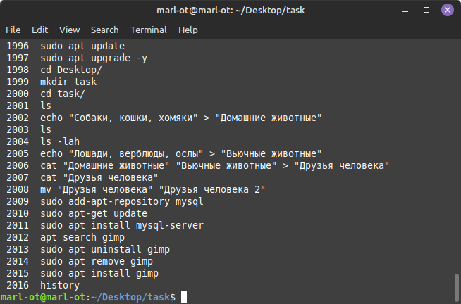
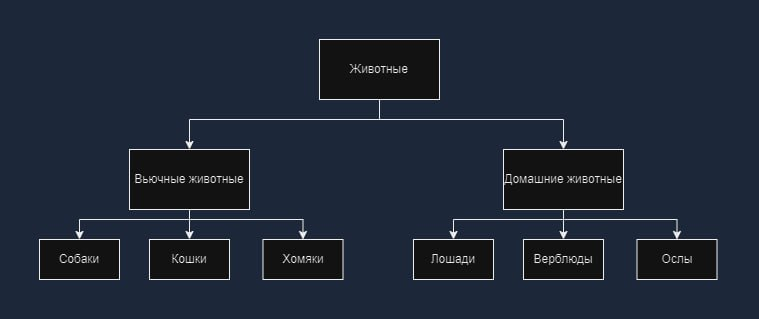
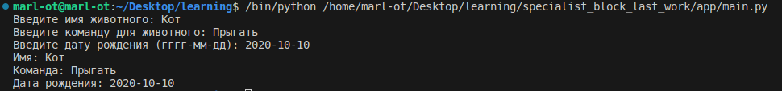

# Итоговая контрольная работа

## Информация о проекте

Необходимо организовать систему учета для питомника в котором живут домашние и вьючные животные.

## Как сдавать проект

Для сдачи проекта необходимо создать отдельный общедоступный
репозиторий(Github, gitlub, или Bitbucket). Разработку вести в этом
репозитории, использовать пул реквесты на изменения. Программа должна
запускаться и работать, ошибок при выполнении программы быть не должно.
Программа, может использоваться в различных системах, поэтому необходимо
разработать класс в виде конструктора.

## Задание

1. Используя команду cat в терминале операционной системы Linux, создать два файла Домашние животные (заполнив файл собаками, кошками, хомяками) и Вьючные животными заполнив файл (лошади, верблюды и ослы), а затем объединить их. Просмотреть содержимое созданного файла. Переименовать файл, дав ему новое имя (Друзья человека).
2. Создать директорию, переместить файл туда.
3. Подключить дополнительный репозиторий MySQL. Установить любой пакет из этого репозитория.
4. Установить и удалить deb-пакет с помощью dpkg.
5. Выложить историю команд в терминале ubuntu
6. Нарисовать диаграмму, в которой есть класс родительский класс, домашние животные и вьючные животные, в составы которых в случае домашних животных войдут классы: собаки, кошки, хомяки, а в класс вьючные животные войдут: Лошади, верблюды и ослы.
7. В подключенном MySQL репозитории создать базу данных “Друзья человека”
8. Создать таблицы с иерархией из диаграммы в БД
9. Заполнить низкоуровневые таблицы именами(животных), командами которые они выполняют и датами рождения
10. Удалив из таблицы верблюдов, т.к. верблюдов решили перевезти в другой питомник на зимовку. Объединить таблицы лошади, и ослы в одну таблицу.
11. Создать новую таблицу “молодые животные” в которую попадут все животные старше 1 года, но младше 3 лет и в отдельном столбце с точностью до месяца подсчитать возраст животных в новой таблице.
12. Объединить все таблицы в одну, при этом сохраняя поля, указывающие на прошлую принадлежность к старым таблицам.
13. Создать класс с Инкапсуляцией методов и наследованием по диаграмме.
14. Написать программу, имитирующую работу реестра домашних животных.

В программе должен быть реализован следующий функционал:
- Завести новое животное
- определять животное в правильный класс
- увидеть список команд, которое выполняет животное
- обучить животное новым командам
- Реализовать навигацию по меню

15. Создайте класс Счетчик, у которого есть метод add(), увеличивающий̆ значение внутренней̆ int переменной̆ на 1 при нажатие “Завести новое животное” Сделайте так, чтобы с объектом такого типа можно было работать в блоке try-with-resources. Нужно бросить исключение, если работа с объектом типа счетчик была не в ресурсном try и/или ресурс остался открыт. Значение считать в ресурсе try, если при заведения животного заполнены все поля.

## Выполнение

1. Используя команду cat в терминале операционной системы Linux, создать два файла Домашние животные (заполнив файл собаками, кошками, хомяками) и Вьючные животными заполнив файл (лошади, верблюды и ослы), а затем объединить их. Просмотреть содержимое созданного файла. Переименовать файл, дав ему новое имя (Друзья человека).

### Создание файлов

    echo "Собаки, кошки, хомяки" > "Домашние животные"
    echo "Лошади, верблюды, ослы" > "Вьючные животные"

### Объединение файлов

    cat "Домашние животные" "Вьючные животные" > "Друзья человека"

### Просмотр содержимого созданного файла

    cat "Друзья человека"

### Переименование файла

    mv "Друзья человека" "Друзья человека 2"

2. Создать директорию, переместить файл туда.

### Создание директории

    mkdir task

### Перемещение файла в созданную директорию

    mv "Друзья человека 2" ./task/

3. Подключить дополнительный репозиторий MySQL. Установить любой пакет из этого репозитория.

### Подключение репозитория MySQL

    sudo add-apt-repository mysql

### Обновление списка пакетов

    sudo apt-get update

### Установка пакета из репозитория

    sudo apt install mysql-server

4. Установить и удалить deb-пакет с помощью dpkg.

### Выполнил установку deb пакета из официального репозитория

    apt search gimp
    sudo apt uninstall gimp
    sudo apt remove gimp
    sudo apt install gimp

5. Выложить историю команд в терминале ubuntu

6. Нарисовать диаграмму, в которой есть класс родительский класс, домашние животные и вьючные животные, в составы которых в случае домашних животных войдут классы: собаки, кошки, хомяки, а в класс вьючные животные войдут: Лошади, верблюды и ослы.

7. В подключенном MySQL репозитории создать базу данных “Друзья человека”

### Создание базы данных в MySQL

    CREATE DATABASE `Друзья_человека`;
    USE `Друзья_человека`;

8. Создать таблицы с иерархией из диаграммы в БД

### Создание таблиц с иерархией

    CREATE TABLE Животное (
        ID INT PRIMARY KEY AUTO_INCREMENT,
        Имя VARCHAR(255),
        Команда VARCHAR(255),
        Дата_рождения DATE
    );

    CREATE TABLE ДомашниеЖивотные (
        ID INT PRIMARY KEY,
        FOREIGN KEY (ID) REFERENCES Животное(ID)
    );

    CREATE TABLE ВьючныеЖивотные (
        ID INT PRIMARY KEY,
        FOREIGN KEY (ID) REFERENCES Животное(ID)
    );

    CREATE TABLE Собака (
        ID INT PRIMARY KEY,
        FOREIGN KEY (ID) REFERENCES ДомашниеЖивотные(ID)
    );

    CREATE TABLE Кошка (
        ID INT PRIMARY KEY,
        FOREIGN KEY (ID) REFERENCES ДомашниеЖивотные(ID)
    );

    CREATE TABLE Хомяк (
        ID INT PRIMARY KEY,
        FOREIGN KEY (ID) REFERENCES ДомашниеЖивотные(ID)
    );

    CREATE TABLE Лошадь (
        ID INT PRIMARY KEY,
        FOREIGN KEY (ID) REFERENCES ВьючныеЖивотные(ID)
    );

    CREATE TABLE Верблюд (
        ID INT PRIMARY KEY,
        FOREIGN KEY (ID) REFERENCES ВьючныеЖивотные(ID)
    );

    CREATE TABLE Осел (
        ID INT PRIMARY KEY,
        FOREIGN KEY (ID) REFERENCES ВьючныеЖивотные(ID)
    );

9. Заполнить низкоуровневые таблицы именами(животных), командами которые они выполняют и датами рождения

### Заполнение таблиц

    -- Собака
    INSERT INTO Животное (Имя, Команда, Дата_рождения) VALUES
    ('Шарик', 'Сидеть', '2021-05-15');
    INSERT INTO ДомашниеЖивотные (ID) VALUES (1);
    INSERT INTO Собака (ID) VALUES (1);

    -- Кошка
    INSERT INTO Животное (Имя, Команда, Дата_рождения) VALUES
    ('Мурзик', 'Лови мышь', '2020-12-10');
    INSERT INTO ДомашниеЖивотные (ID) VALUES (2);
    INSERT INTO Кошка (ID) VALUES (2);

    -- Хомяк
    INSERT INTO Животное (Имя, Команда, Дата_рождения) VALUES
    ('Червячок', 'Крутись в колесе', '2020-11-20');
    INSERT INTO ДомашниеЖивотные (ID) VALUES (3);
    INSERT INTO Хомяк (ID) VALUES (3);

    -- Лошадь
    INSERT INTO Животное (Имя, Команда, Дата_рождения) VALUES
    ('Гроза', 'Беги по полю', '2019-06-25');
    INSERT INTO ВьючныеЖивотные (ID) VALUES (4);
    INSERT INTO Лошадь (ID) VALUES (4);

    -- Верблюд
    INSERT INTO Животное (Имя, Команда, Дата_рождения) VALUES
    ('Ахмед', 'Ходи по песку', '2018-09-12');
    INSERT INTO ВьючныеЖивотные (ID) VALUES (5);
    INSERT INTO Верблюд (ID) VALUES (5);

    -- Осел
    INSERT INTO Животное (Имя, Команда, Дата_рождения) VALUES
    ('Петр', 'Тяни груз', '2020-02-15');
    INSERT INTO ВьючныеЖивотные (ID) VALUES (6);
    INSERT INTO Осел (ID) VALUES (6);

10. Удалив из таблицы верблюдов, т.к. верблюдов решили перевезти в другой питомник на зимовку. Объединить таблицы лошади, и ослы в одну таблицу

### Удаление верблюдов

    DELETE FROM Верблюд WHERE ID = 5;

### Объединение таблиц лошадей и ослов

    CREATE TABLE ЛошадиОслы AS
    SELECT * FROM Лошадь
    UNION
    SELECT * FROM Осел;

11. Создать новую таблицу “молодые животные” в которую попадут все животные старше 1 года, но младше 3 лет и в отдельном столбце с точностью до месяца подсчитать возраст животных в новой таблице

### Создание таблицы "молодые животные"

    CREATE TABLE МолодыеЖивотные AS
    SELECT *, TIMESTAMPDIFF(MONTH, Дата_рождения, CURRENT_DATE) AS Возраст_в_месяцах
    FROM Животное
    WHERE Дата_рождения BETWEEN DATE_SUB(CURRENT_DATE, INTERVAL 3 YEAR) AND DATE_SUB(CURRENT_DATE, INTERVAL 1 YEAR);

12. Объединить все таблицы в одну, при этом сохраняя поля, указывающие на прошлую принадлежность к старым таблицам

### Объединение всех таблиц

    CREATE TABLE ОбщаяТаблица AS
    SELECT *, 'ДомашниеЖивотные' AS Тип FROM ДомашниеЖивотные
    UNION
    SELECT *, 'ВьючныеЖивотные' AS Тип FROM ВьючныеЖивотные
    UNION
    SELECT *, 'Собака' AS Тип FROM Собака
    UNION
    SELECT *, 'Кошка' AS Тип FROM Кошка
    UNION
    SELECT *, 'Хомяк' AS Тип FROM Хомяк
    UNION
    SELECT *, 'ЛошадиОслы' AS Тип FROM ЛошадиОслы
    UNION
    SELECT *, 'Верблюд' AS Тип FROM Верблюд
    UNION
    SELECT *, 'Осел' AS Тип FROM Осел;

[Продолжение...](./app/)

